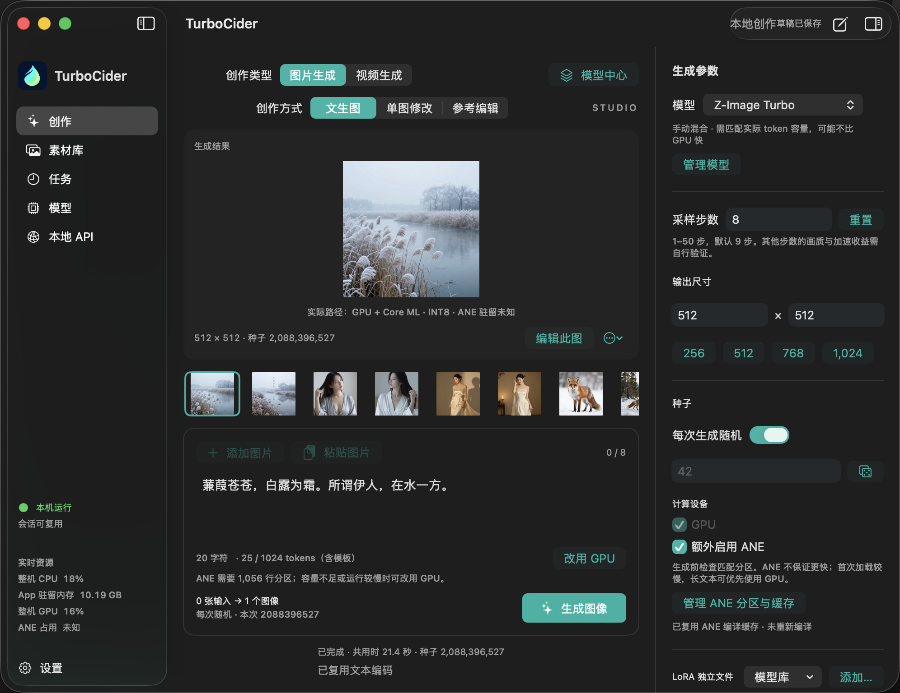

<p align="center">
  
</p>

<p align="center"><strong>Native inference. More of your Apple silicon.</strong></p>
<p align="center">SwiftUI Studio · Native CLI · C / Swift SDK · Local API</p>
<p align="center"><a href="README.zh-CN.md">中文</a> · <strong>English</strong> · <a href="docs/public/GETTING_STARTED.md">Getting started</a> · <a href="docs/public/PERFORMANCE.md">Benchmarks</a></p>

TurboCider is a local multimodal inference engine for Apple silicon. It turns unified memory into an opportunity for **heterogeneous execution: the CPU orchestrates native work while GPU and ANE process selected model partitions in parallel**. Shared output buffers, compiled GPU graphs and reusable sessions reduce copies and repeated preparation in compute-intensive image inference.

Create images and videos in a native SwiftUI studio, automate jobs with the CLI, or embed the same runtime through C / Swift bindings and a local task API. Models and generated media stay on your Mac.

## App preview



## What makes it different

- **Hardware-aware parallelism:** Metal / MLX on the GPU and Core ML FFN partitions eligible for the Neural Engine, coordinated by the CPU.
- **Measured performance and fidelity:** FLUX.2 Klein 4B at 512×512, 4 steps on M4 Max 64 GB achieved **1.39× throughput and 28% lower generation time**, with GPU-to-hybrid pixel cosine similarity **0.999840**.
- **Reuse across requests:** resident sessions, prompt encoding caches, compiled graphs and Core ML artifact caches. Z-Image's flexible ANE partitions support up to 512 encoded text tokens at 512×512.
- **One runtime:** native App, CLI, C / Swift SDK and a local Unix socket job service share execution contracts.
- **Explicit capabilities:** image generation, image editing and video generation are offered only where the executor supports them. LoRA and GPU / ANE controls remain explicit.
- **Shared model management:** App / CLI registrations, ModelScope / Hugging Face download previews and compatible text-component reuse. Start the local API from the App and manage regenerable text-tensor retention.

The ANE routes use validated INT8 partitions: they are high-fidelity approximations, not bit-exact inference. Gains depend on hardware, model and shape. GPU is the default. Core ML compute-unit selection is not proof of ANE occupancy. These are reproducible workload results, not a universal SOTA claim. See the measurements below and [benchmark methodology](docs/public/PERFORMANCE.md).

## Performance highlights

**More performance from the same Mac: 1.39× on M4 Max FLUX GPU → hybrid,
1.34× versus the recorded ComfyUI Z-Image workload, and up to 1.64× in a
historical M4 Pro FLUX snapshot.**

Selected **warm request medians**, not the fastest individual run:

| Workload | Baseline → TurboCider | Speedup |
|---|---|---:|
| FLUX 4B · M4 Pro 48 GiB · 512² · 4 steps | Native GPU 4.758 s → GPU + ANE **2.896 s** | **1.64×** |
| FLUX 4B · M4 Max 64 GB · 512² · 4 steps | Native GPU 2.266 s → GPU + ANE **1.628 s** | **1.39×** |
| Z-Image Turbo · M4 Max 64 GB · 1024² · 9 steps | Stock ComfyUI GPU 40.110 s → GPU + ANE **30.001 s** | **1.34×** |

The M4 Max FLUX hybrid result cuts request time by **28.2%**, with recorded
GPU/hybrid PNG cosine similarity **0.999840**. Native Z-Image GPU alone took
36.369 s; its hybrid route adds **1.21×** over that optimized GPU baseline.

Results vary by device and workload. Warm timings exclude initial setup and compilation; detailed test conditions are linked below.

[Performance and fidelity](docs/public/PERFORMANCE.md) ·
[Public samples, conditions and comparison limits](docs/public/BENCHMARKS.md)

## Build and run

Use an Apple silicon Mac, a working macOS SDK / Swift / Clang toolchain and MLX 0.32.x. Full Xcode is recommended; an existing Command Line Tools installation can be selected with `DEVELOPER_DIR` and `SDKROOT`. Python 3.11 is used for setup and offline tools; all production inference paths, including Wan, are native. Python export and merge tools are development-only.

```sh
make setup
make package
make test
open dist/TurboCider.app
```

Choose image or video creation in the App; a compatible executor is selected automatically. Register its model folder and generate with GPU first. Compatible Z-Image text components can be linked from a local FLUX.2 Klein 4B installation. Configure ANE only after preparing artifacts for the actual model, shape and LoRA identity. Current packages are locally ad-hoc signed, not notarized releases.

For automation, use `dist/cli/turbocider generate MODEL_DIRECTORY REQUEST.json`. `batch` reuses a session; `serve` exposes the local job API. See [getting started](docs/public/GETTING_STARTED.md) and the [request / SDK / API reference](docs/public/USAGE.md).

## Model capabilities

`turbocider models` reports the authoritative executable operations. Availability below describes the current runtime, not every upstream model feature.

| Model | Output | Input | Notes |
|---|---|---|---|
| FLUX.2 Klein 4B / 9B | Image | Text; image transform; reference editing | 4B has qualified hybrid profiles; 9B performance coverage is incomplete |
| Z-Image Turbo | Image | Text | Comfy / Diffusers layouts; in-memory LoRA; flexible ANE inputs |
| MiniMax H3 Turbo | Video | Text; keyframes; references | Native Metal / MPS; artifact-gated ANE; media tools required |
| LTX 2.5 Distilled | Video | Text, video-only | Image input and audio remain gated; staged residency |
| Wan 2.1 1.3B QAD | Video | Native MLX / Core ML, 832×480, 3 steps | Offline-converted TAEHV; verified premerged LoRA only |

Weights retain their upstream licenses. Large model files and generated outputs are not included in the repository.

## Project map

| Directory | Responsibility |
|---|---|
| `native/` | Inference core, model executors, Metal / MLX / Core ML backends |
| `apps/` | SwiftUI App and native CLI |
| `services/` | Persistent local task service and model/cache management helper |
| `bindings/` | C ABI and Swift SDK |
| `profiles/`, `examples/` | Hardware policies and runnable request examples |
| `tools/`, `tests/` | Setup, packaging, conversion, regression and benchmark tools |
| `assets/branding/` | Turbo Drop artwork and reproducible App icon |
| `docs/public/` | Self-contained English user guides and published benchmark evidence |

[Documentation](docs/public/README.md) · [Benchmark evidence](docs/public/BENCHMARKS.md)

[Model library](docs/public/MODEL_LIBRARY.md) · [Local API](docs/public/LOCAL_API.md) · [Cache and memory](docs/public/CACHES.md)

Original TurboCider code uses the MIT license. Third-party code and model
weights retain their respective terms; retain the license and notices supplied
with the source or package.

[Native model capabilities, GGUF limits and LoRA](docs/public/USAGE.md#model-capabilities).
