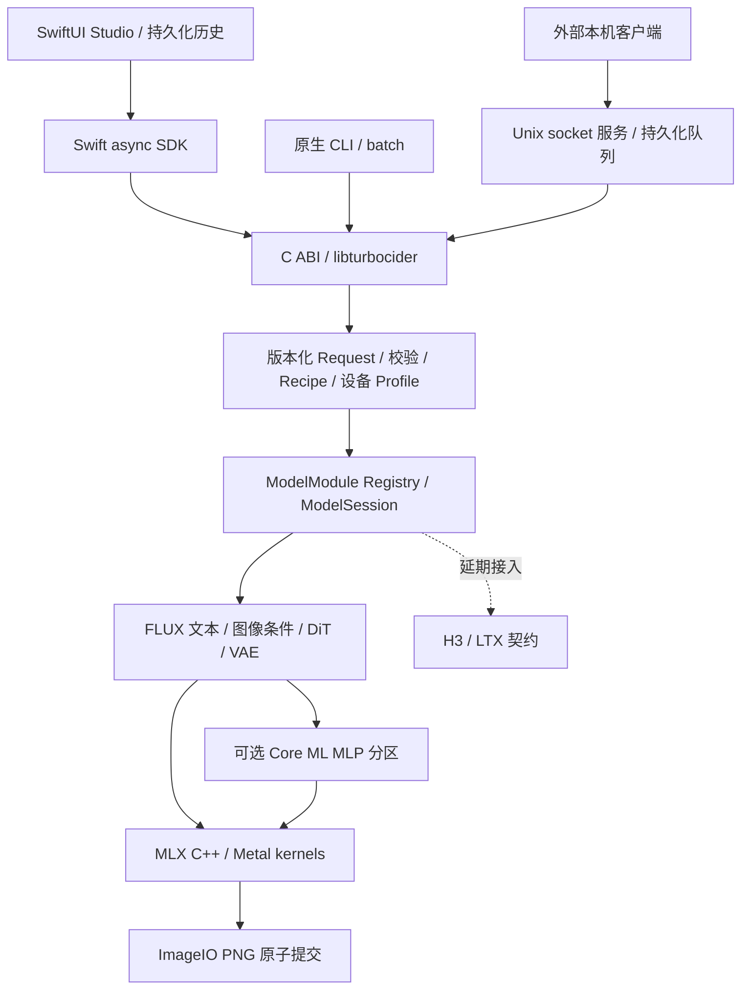

# TurboCider 原生重构：FLUX 首发实现与后续模型边界

2026-09-05。本文是当前实现状态的入口，优先于此前的纵切验证报告。最新范围按用户要求收敛到完整 FLUX.2 路径；H3/LTX 以接入设计和验收契约推进，不以缺少真实权重为由宣称数值正确。

## 实际架构

一个动态库包含实际推理，无 Python/原引擎 CLI 子进程。动态库用于 App 嵌入、CLI 或常驻服务。服务与 App 共享同一推理实现，但当前 App 使用嵌入会话，未接入服务队列；多个客户端需要共享队列时使用服务 RPC。跨进程文件锁避免两个 TurboCider 进程同时开始 GPU 作业，冲突明确返回 busy。这不是把外部任意 Metal 程序纳入全机调度。

## 代码模块与所有权

| 目录 | 当前职责 | 扩展原则 |
|---|---|---|
| `bindings/c/include` | 稳定 C ABI、opaque engine、错误/结果字符串释放、同步事件与取消 | API 增量扩展；JSON 请求有版本；不得暴露 C++/MLX 对象给调用者 |
| `native/core/contracts.hpp` | 不含 Apple 对象的 Request、InputAsset、Stage、Recipe | 输入种类与角色分开；模型语义由模块验证 |
| `native/core/json.mm` | 严格解析 schema 1/2，拒绝未知字段、错误类型和越界值 | 不通过环境变量暗改精度、步数或后端 |
| `native/core/profile.mm` | 显式启用、GPU 名称/内存匹配、预算、驻留、预热及 artifact 配置 | 默认 GPU；未知机器不套用他机混合策略 |
| `native/core/api.mm` | 进程内与跨进程准入、流生命周期、异常边界、取消/事件 | 不在 token/block 热路径解析 JSON |
| `native/models/registry.mm` | ModelModule 注册、描述、校验、Session 工厂 | 新模型增加模块；不要在客户端堆模型名分支 |
| `native/models/flux*.mm` | Qwen3、DiT、VAE 编解码、采样、条件缓存和组件驻留 | 数学子图保持模型专属；不同模型不强套同一种 block |
| `native/backends/mlx.mm` | MLX C++ 算子、权重映射、自定义 Metal Euler | MLX 负责张量和分配；不声称已重写通用 Metal 算子库 |
| `native/backends/coreml*` | 固定桶 MLP 加载、公开 Core ML 执行、共享输出 backing、观测指标 | 有依赖的块内 join；不将 CPUAndNeuralEngine 当实际 ANE 驻留证据 |
| `native/backends/artifact_cache.mm` | 本地模型编译、源内容哈希、OS/GPU 身份、互斥、临时目录原子提交 | 不在每个 denoise step 编译；内容/系统变化使缓存失效 |
| `native/media` | ImageIO 读取/方向/颜色/缩放、PNG 原子输出；原生 AV 草稿在experimental | 预处理也是模型语义；不能只验最终文件存在 |
| `apps/cli` / `services/turbociderd` | CLI、batch、Unix socket 服务、任务恢复/取消/分页 | 后端服务不重新实现推理；控制消息不传大张量 |
| `apps/macos` / `bindings/swift` | async SDK、主线程 JobStore、SwiftUI 创作界面 | UI 不拥有 GPU 张量、不执行模型数学 |
| `tests/native` / `tools/native` | 契约、生命周期、服务、oracle、对比性能、构建/打包 | Python 仅用于开发验证，不进入运行依赖 |

H3 Session、LTX Gemma/去噪器与vendor已隔离到 `experimental/video/`，不进入默认库目标。H3/LTX executor为false。旧 `src/`、`Sources/`、`engines/`、Python包与旧构建入口已删除，必要历史可从Git恢复；详情见 [项目重构](project-restructure.md)。

## FLUX 首发能力

- 本地官方 FLUX.2-klein-4B BF16：原生 Qwen3→5 双流块/20 单流块→4 步默认 Euler→VAE→PNG。
- `image.generate` 文生图；`image.transform` 单 init_image 与 strength；`image.edit` 1–8 张有序参考图。参考图顺序参与位置编码。
- 英文/中文 tokenizer；动态文本或固定 512 桶；严格最大 token 校验。输出宽高 16 倍数、64–2048，但大尺寸受内存准入限制；不代表全部尺寸完成性能认证。
- 1–50 步、固定种子；schema 2 输入资产与输出对象；种子当前限制 0–2147483647。更广模型/量化/LoRA 接口需另增能力契约，当前不隐式接受。
- GPU 默认；显式 profile 才选择混合分区。混合使用本地现有 INT8 MLP，精度路线单独标记。
- 驻留模式保留权重与相同 prompt conditioning；换 prompt 先释放 DiT/VAE 再编码，避免 Qwen 峰值叠加。分阶段模式在 decode 前释放 DiT、完成后释放 VAE；仍可保留小型 conditioning。FLUX 不支持假装有效的 `streamed` 设置。
- 进度、取消、安全导出边界、失败恢复、计时、MLX 内存统计、计划预检。
- 原生 App：选择模型/素材/配置、文生图/图生图/多参考编辑、尺寸/步数/种子、驻留设置、取消、结果预览、Finder 定位、历史参数复用与重启恢复。
- 本地服务：队列上限 32、单 GPU worker、持久任务、排队/运行取消、模型复用、分页历史、重启 interrupted 恢复、当前用户 socket；C 与 Swift SDK 可嵌入其他应用。

## GPU / ANE 性能边界

FLUX single block 的 attention 与 MLP 使用同一 block 输入，可将独立 MLP 交给 Core ML，同时提交 GPU attention，然后在 residual 合并前等待。双流块、Qwen、VAE 仍走 GPU。本机 legacy artifact 固定 1088 rows，只能服务包含文本、生成图 token、参考图 token 后不超过该桶的请求；超出会报错，不静默裁剪。

本次已删除 Core ML→MLX 的常规输出复制：MLX 持有 materialized 连续 FP16 缓冲区，Core ML output backing 指向它；每个 block 完成消费后才能复写。框架拒绝 backing 时按实际 strides 复制并计数。实测共享路径 `output_copy_bytes_session_total=0`，优化前后输出 PNG 相同。输入转换与 padding 仍有成本，不能把整条流程称为零拷贝。

`compile-coreml SOURCE CACHE` 编译已存在的本地 `.mlpackage/.mlmodel`，按源内容+系统+设备生成缓存键并原子安装；它不负责从任意 PyTorch 模型自动划分/转换 ANE 子图。已有 legacy manifest 仅具 checkpoint path+size，无源 SHA，故混合仍标记实验。通用 partition compiler、自动搜索最优切分、FLUX block offloading 是后续能力，不能由一个配置字段假装已经实现。

内存准入当前是保守估计和用户预算，不是硬内存上限；MLX peak 不含 Core ML/系统缓存。默认速度优先保留权重，压力场景显式改 component_staged。全局只准入一个推理任务，块内 GPU/Core ML 可并行；以此避免多任务并发争抢统一内存导致整体更慢。

## 验证与性能证据

早期文生图：英文 512×512 与中文 320×256/固定文本桶各 22 组中间张量逐值一致，见 `validation/flux-512-parity.json`、`flux-chinese-fixed-parity.json`。新图生图和参考图编辑的证据分别为 `flux-transform-parity.json`、`flux-edit-parity.json`。这些是具体 fixture 的证据，不是所有输入的数学证明。

图生图迁移中定位并修复了 GPU FP32 sigma 与 CPU double schedule 的差异、初始化 latent 精度、single-block Q/K normalization 的 BF16 舍入，以及混合 dtype attention 输出被错误降精度的问题。修复后对应参考中间张量逐值一致。

最终重复性能报告见 [FLUX 对比](flux-performance-comparison.md)。原始 flux2-engine 默认整图编译融合，原生路径与其 eager 参考精度一致；融合模式可能产生不同舍入，因此把“原始引擎运行速度”与“eager oracle 逐值正确性”分开报告，不用降低步骤或变更精度换取速度。

## 交付边界

本次可用产品范围是 FLUX 图像生成系统，不是三模型全部验收。H3/LTX 默认不可执行；接入与验收见 [视频模型文档](video-model-acceptance.md)。本机 ad-hoc 签名包已用于开发验收，尚未 Developer ID 公证、Mac App Store 沙盒化或跨 macOS/芯片矩阵认证。现有单图输出不等于批量多图、LoRA、节点图编辑器或断点续推已经实现。
