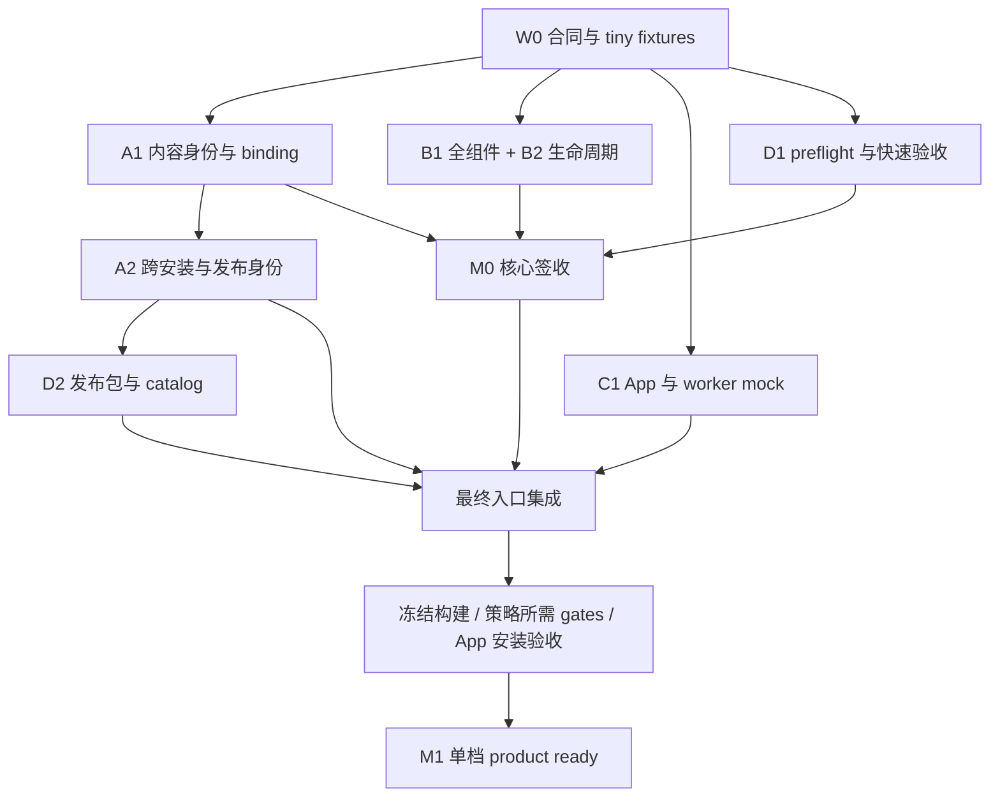

# 56 · Production readiness 复核与最短验收路径

日期：2026-09-20。代码基线：`feat/stream@8e2e97ed1cef33b0fbd8a954c9f193826ff2846b`。
本文是代码复核和下一阶段设计，**不是新增 release qualification**。本文文档工作均未修改 runtime、发布 catalog 或运行真实模型、Metal、swap/压力实验；第 11 节补充 GPU/ANE 实现边界。
既有实验数字引用 [13](13-implementation-progress.md) 第 13.49–13.54 节和 [55](55-current-state-and-next-phase.md)，不是本轮重测。

本次按“快速验证、以框架为后续开发核心、有限范围 product ready”的要求细化。**执行以第 5–9 节为准**：先验收 M0 开发基座，再发布 M1 单档产品；第 2 节保留缺口分析，不意味着所有问题必须串行修完才能开始验证。以下新增接口、文件、命令目标和工期均为拟议，不能当作已经实现。

GPU/ANE 的能力判断在第 11 节；其逐文件实施方案、H0–H4 依赖、近似质量工具、测试 ID 与 ANE model bank 实验见 [57 专项附录](57-gpu-ane-integration-and-delivery-plan.md)。57 不替换本文件的来源/worker/发布合同，hybrid 不进入 GPU M0/M1 的关键路径。

## 1. 判断与范围

通用 streaming 的主要机制已经成立：确定性 layout compiler、固定 slot backing、有界 I/O、reader fence、carry、multi-pool、fd SourceLease、exact resolver、actual receipt 和独立 evidence verifier 都有实现和测试。
当前状态适合继续内部集成验收，尚不适合把 public memory tier 交付给普通用户。

**差距不仅是 catalog 为空、P3 未跑。还存在 record 跨安装复用、App options、Z-Image 全组件来源、请求事务和失败清理等代码闭环问题。先修这些，再冻结正式实验；否则实验通过后仍需换 identity 重跑。**

建议分开签收三个交付物：

| 交付物 | 验收含义 | 当前判断 |
|---|---|---|
| 框架工程验收 | layout/slot/fence/receipt/错误协议成立，明确限定 adapter 和执行条件 | 基础较成熟；真实 adapter 的失败闭环仍需补齐 |
| 单档产品验收 | 一个 model × artifact × workload × device × container × target，从 App 到成品与清理完整通过 | 优先 Z-Image 10 GiB；目前不能签收 |
| 广泛 production / bounded 认证 | 多安装、多设备、长期使用，以及明确的内存上限与异常恢复合同 | 当前未达成；不与首个限定档位混为一谈 |

首发建议：GPU-only、单作业、Z-Image Comfy BF16、512×512、9 steps、10 GiB、冻结 token shape 和设备范围。
使用已有 P7/G1/K2/D0/Q1 作为起点，不重新开启无限布局搜索。支持范围内的短/长 prompt、不同 seed 另做质量和生命周期检查；未认证 token shape 必须明确拒绝。
接下来是 Flux 9B 16 GiB。H3、LTX、ANE、LoRA、其他格式及全五档不作为首次限定发布的共同前置条件。

“已有的无 bug 且完善”在验收中定义为：**支持范围内已知阻断/高严重度缺陷为零，功能、取消、错误和产物合同完整，规定测试通过，未支持能力明确拒绝**。测试不能证明任意场景永无 bug；用可复现的回归保护后续迭代，而不是为未知问题无限延期。

## 2. 代码复核发现

这里的“首发阻断”指开放相关 public 路径前必须关闭，不指默认 Off 路径已发生问题。静态发现、host 复现和历史实测分别标注。

### R1 · Catalog source identity 绑定了本机文件实例，尚不是可分发模型身份

证据：`native/runtime/streaming/source_lease.cpp::observed_digest()` 编码 device、inode、mtime、ctime 等；
`z_image_public_source_identity()`、`flux_public_source_identity()` 又从 lease digest 生成 artifact manifest identity；
`resolve_streaming_preset()` 在 exact 查询时比较完整 `PresetSourceIdentity`。
Z-Image/Flux 的 capture 输入未提供权重内容 digest。哈希 stat 元数据不等于哈希模型内容。
此外 Z-Image descriptor 把 snapshot identity 写入 descriptor，compiler 再把它纳入 layout digest。

**本轮 host 复现**：同一份 fixture 原样复制，lease digest 改变；原 record 对复制文件返回 `artifact_verification_required`。
因此在开发机生成 record 后，用户重新下载同一模型也不能直接复用。只删除 source equality 还不够，layout identity 同样要处理。
这也不符合 [54 §8](54-public-streaming-deep-implementation-spec.md) 中“stat 只能检测失效，不能代替内容身份”的合同。

修复设计：拆成三个独立身份，保留现有 fd 安全机制。

- **ArtifactIdentity**：逻辑文件名、大小、内容 SHA-256、可信 import/merge manifest，跨安装稳定。导入/下载时验证并缓存，避免每次生成重读全部权重。
- **LayoutIdentity**：内容身份、tensor geometry/materialization、workload、P/G/K/D/Q、reader/kernel/component revision；不包含 inode、路径或 mtime。
- **SourceBinding**：本次打开的 fd、stat、path revalidation 和 generation，仅用于当前 request 的 TOCTOU/修改检测；不作为可分发 record 的键。

缓存的内容证明必须绑定已验证文件 generation；文件改变后重新验证，不能给任意现存文件贴一个 manifest。
修改需同步 native canonical encoder、Python builder、test-catalog、receipt/authority 和 schema/revision；旧证据不能直接换 digest 冒充新证据。

验收：相同内容的另一目录/另一安装可 resolve；相同大小但不同内容不可 resolve；request 中途替换/截断仍拒绝；layout digest 跨安装稳定。

2026-09-21 增量：Z-Image metadata 新增显式 `describe_verified()`，要求 native verified lease，使用全 lease 的内容身份与 transformer SHA-256 生成 portable descriptor，保留独立的 request snapshot 和 revalidation。Host 测试覆盖跨目录复制布局相同、binding/generation 不同、同大小 payload 改写、辅助 tokenizer 改写、删除、伪造 caller digest、workload/预取策略变化；已通过。该接口不在查询时 hash 权重。现有 `describe()`、public probe/compile 和 catalog 仍走 legacy snapshot 路径；persistent import proof、RecordV2/native/Python/receipt 联动迁移及跨安装 resolve 验收仍待完成，R1 尚未关闭。

RecordV2 格式增量：`source.identity_version=2` 要求 `model_variant`、`weight_format`、`artifact_manifest_digest`，禁止序列化 `source_snapshot_digest`。省略版本或显式 1 使用原 v1 字段与原 canonical bytes；其他版本拒绝。v2 的 record、record digest、record identity 和 source identity 分别使用独立 `*-v2` domain，native/Python 字段顺序一致，test-catalog JSON 同步支持。固定 native/Python record 样例 SHA-256 为 `c322e18cabc2ed4756a8cbbc468c24989ba175dda64745902014a1971aca0bb0`，v1 原样例仍为 `13b5797176d713924b9c16857acbf0f7a35313d2426a22fdca38c488b3ea3df1`。这一步只完成格式合同，内容证明不能由 JSON 自授；core resolver/value probe/authority 已支持 v2 native verified lease，并将 request generation 与 snapshot digest 单独绑定 authority；host 复制测试验证同 record 可选而不同请求不能共用 authority。实际模型 public probe 仍为 legacy。后续必须将模型导入验证、portable descriptor 与 receipt 的真实执行一起接通，不能删除版本保护后直接发布旧 calibration。

2026-09-21 后续：已增加 `tc_engine_verify_streaming_sources_json`，Z-Image 显式验证后 probe 使用 capture_preverified，plan/source identity 与 core resolver/authority 接通 v2。真实本机四文件摘要复核、取消重试、零 payload 复验及合成 test-catalog 下的公开 adapter 图片/receipt 均通过，详见实验记录第二十六轮。默认未验证 engine 的 legacy 路径暂留；persistent import proof、App 验证 UI、Flux 迁移和生产 record 正式证据仍缺失，R1 不能标为关闭。

### R2 · Options 查询不能匹配真实完整 record

证据：`native/api/c_api.mm::tc_streaming_options_json()` 只填 model、shape 等基础 workload；没有填 conditioning revision、VAE policy、feature digest 和 token shapes。
`PresetWorkload::operator==` 是全字段比较，`preset_catalog.cpp` 不因 `require_exact_identity=false` 放松 workload 比较。
模型 probe 生成的合法 record 则含有这些字段。

**本轮 host 复现**：完整 query 能选中 record；清空 options 当前缺失的四类字段后，返回 `unvalidated_workload`。
空 catalog 的现有 UI 测试无法暴露这个问题。填入 record 之后仍可能所有档位 unavailable。

修复设计：

1. 不带模型安装信息的便宜 options 只返回 `candidate / needs_artifact_verification / unavailable`，做显式的基础字段筛选，不调用完整相等比较伪装精确判断。
2. 安装绑定后的 metadata probe/query 复用 resolver 的 workload 构造逻辑和实际 container，才返回 `available`。不为查询加载 GPU 权重。
3. generate 保留完整 exact matching 和最新 catalog/source revalidation。不能为修 UI 把 generate 改成模糊匹配。
4. 加非空 catalog 测试、不同 token shape 测试和状态解释文案。

### R3 · Z-Image public 的来源与缓存闭环未覆盖所有组件

证据：probe 捕获 transformer/text/VAE 三个文件，但 `encode_text()` 和 `load_vae()` 仍调用 path-based `load_z_component()`；tokenizer 不在该 lease 文件集合中。
exact request 开头清 transformer，但仅 K1 清 VAE，也没有像 Flux public 路径那样清 conditioning cache。
因此 denoiser 的 fd receipt 不能单独证明 text/VAE/缓存也来自本次授权源。尤其同一 session 换源后，同 prompt 缓存未绑定 source digest。

这是静态确认的覆盖缺口；本轮没有注入真实模型替换来声称已观察到错误图片。

修复设计：public text/VAE 使用同一 SourceLease 的 reader，纳入 tokenizer/config 等影响计算的资产身份；public 首版不复用无来源键的 conditioning/VAE 缓存。
若要复用，缓存键必须包含 component artifact identity、tokenizer/template、prompt/token shape 和相关 policy revision。
可复用 Flux `flux_text.cpp` / `Weights::load_lease()` 的现有机制，不新增另一套 pager。

验收：resident→public、public A→B→A、同 prompt 换 encoder/VAE、取消后重试、来源替换；执行来源和输出一致，旧缓存不跨 generation 冒充新源。

### R4 · 安全析构有协议，但模型失败恢复尚未统一接上

2026-09-21 进展：Flux/Z-Image exact denoiser 已接上完整 engine 保留、进程 quarantine 与 App 重启提示；两模型真实权重正常/取消重试/注入 unsafe drain 的六项检查通过，见 [实验第十八轮](../../experiments/2026-09-20-m1-streaming.md#第十八轮z-image-exact-owner-与取消异常传播)。以下为审查时证据；encoder/VAE、其余故障边界与有界 worker 恢复仍待关闭，R4 未整体完成。

证据：`PublicStreamingRunContext` 在 native 中的调用点目前限于自身实现，实际构造主要在 resolver host test；四模型 public 方法仍使用各自 owner/receipt 路径。
`tc_engine::streaming_quarantined` 有初始化和读取，当前无置 true 的路径。
Z-Image exact owner 默认析构，异常路径会 reset executor；`StageExecutor::~StageExecutor()` 在 unsafe drain 时执行 `std::terminate()`。
H3/LTX 已有专门 quarantine owner，不能据此说所有模型都缺取消；但 common 测试通过也不能证明 Z-Image/Flux 已接入相同失败隔离。

另一个限制：owner pump 的 60 秒 stall timeout 不覆盖同步 backend 阻塞；`IoExecutor::shutdown_and_join()` 无界 join。
如果 reader/backend 不返回，超时不等于可在 60 秒内回收。禁止为强制返回 detach 仍会访问 backing 的线程。

修复设计：

- 对普通 cancel/read failure：stop dispatch → cooperative cancel → join/drain → 安全释放 → 可重试。
- 对无法证明安全的 drain：保留完整 request owner（不只 executor，也包括 lease、pager、模型 backing、callback 引用），poison session；API/JobStore 禁止重用。
- 修通 engine 状态与实际 owner 的传播，保留 primary error 和 cleanup error；不能只增加一个永远不置位的标志。
- 要承诺故障后的有界恢复时，把对应 public 路径放到 disposable worker，supervisor 管 deadline、整个 child tree 和退出回收。不能仅重建同进程 engine 就宣称释放 process quarantine。
- 首批只收口首发模型的 owner；使用已有 context 或补足当前 owner 均可，以行为验收为准，不为统一类名大规模重写 H3/LTX。

验收：首次 fill、ready、reader pending、最后一步、VAE/export 取消；EOF/分配失败/drain failure；失败后再次 generate、unload、free；既不提前释放也不意外终止桌面进程。不可恢复时明确要求 worker/process 重启。

### R5 · App 事务、worker 结果消费和推荐还需要补齐

代码事实：

- `JobStore.generate()` 保存 `resolveStreaming()` 的结果，但仍把原始 memory-tier request 交给 generate，没有将 `resolution.exact_selector` 写回请求。当前静态 catalog 降低了触发机会，但持久化的 resolution 没有约束实际执行选择。
- `LTXWorker` 只要求 exit=0、JSON 是 dictionary、output path 存在。现有 Swift fixture 用 `{}` 和预建空文件即可通过，这证明的是请求转发，不是 public 成功事务。
- `recommendedStreamingSelection` 按物理 RAM 选档，没有 resident-fit；修好 options 后，大内存机器可能被自动开启 streaming。
- `streamingQueryKey` 未包括模型路径、prompt/token shape、profile 等所有会影响资格的输入。`.task(id:)` 的 cancellation 检查已有保护，但应补完整 query identity 和非空 catalog 乱序测试。

修复设计：

1. immutable draft snapshot → resolve → 用 exact selector 冻结可序列化请求 → 保存 pending job → generate → 比较 returned identity → 保存 terminal job。
2. LTX 保持 worker-local resolve。worker 返回 request/job correlation、exact resolution、actual verified summary、output 信息；parent 验协议和关联，不反序列化 native authority/fd。
3. public 成功必须有正确 schema/model/request、`actual_plan_verified=true`、匹配 target/resolution 和有效新产物；任意 `{}`、旧文件、空文件不能成功。
4. 输出先写 request-scoped staging，完成验证后原子发布；失败留下的是诊断，不应覆盖已有成品。
5. 首个限定发布可先默认 Off、显式选档；自动推荐在 resident-fit evidence 存在时启用。显式 Off/指定档位优先，unavailable 不自动改 Off 重跑。
6. typed error 包含 `code / phase / retryability / recovery_action / primary_error / cleanup_error`；JobStore 对安全 cancel、可重试失败和需重启隔离分别处理。

### R6 · 发布身份、运行容器与证据范围不能只靠标签

Z-Image/Flux 的 `turbocider_build_id` 当前是固定版本字符串；更新 runtime 后需可验证地改变兼容身份，不能靠忘记更新的手工标签持续沿用 qualification。
`tc_engine.execution_container` 默认 `embedded_app`，当前未见赋予 CLI/disposable worker 区分值的接线；options 也硬编码 `embedded_app`。
这会削弱“相同 container evidence”检查：标签相同不代表实际进程生命周期相同。

建议构建生成 runtime compatibility fingerprint（源码/依赖/编译策略），catalog 独立 revision；封存实际 binary 和 bundle hash。
容器由受控入口确定，首版至少区分 App embedded 与 disposable CLI worker；不能让普通 request 自报更宽松容器。
P2 使用发布入口同样的 root/child boundary、冷暖缓存和生命周期。要说明 App 是否被纳入采样，不能把 worker-only 峰值叫整个桌面 App 峰值。
发布后的撤回策略首版可以是新 bundled catalog + App 更新；现有 production provider 为静态 snapshot，不应声称已经实现远程即时撤回。

## 3. 四模型应如何排序

以下是文档中的历史证据，**不代表本轮或最终 release commit**：

| 模型 | 已有证据 | 现在最值得做的事 |
|---|---|---|
| Z-Image 10 GiB | clean public-semantics P2 40/40、byte-exact、tree peak P95 8,967,879,115.6 bytes（约 8.35 GiB）、swap 0 | 优先关闭 R1–R5 的相关阻断，再冻结首个完整 release record |
| Flux 9B 16 GiB | 同布局 P1 wall ratio 0.99971；P2 memory 项通过，但 environment partial，整体 INCONCLUSIVE | 复用通用修复；补完环境和 clean P0/P1/P2/P3；不能只挑 memory PASS |
| H3 Turbo | 历史工程 P1 点估计约 +1.07% wall、+1.19% denoise；统计仍 INCONCLUSIVE | 获取可信 Turbo merged artifact/merge manifest，然后做 public 全请求认证；普通 H3 不可顶替 |
| LTX 20 GiB | fd-backed exec finalizer + verified envelope 可输出 MP4；P1/K1 单请求 tree peak 约 18.247 GiB | 做 zero-prefix 的几何脱钩，验证 P0/K1；仍超 18 GiB 则考虑分阶段 disposable pipeline |

Z-Image 的约 8.35 GiB 是 **10 GiB 请求档位的测量**，不能推出 10 GiB 物理机器一定可运行；设备资格和系统余量另验。
LTX 的 18.247 GiB 超出 20 GiB 档位按现有余量计算的 18 GiB 门槛约 253 MiB；它只是单次诊断，既非正式 P2，也不能靠四舍五入过关。

LTX 具体设计延续 [55](55-current-state-and-next-phase.md)：

- 从 checkpoint metadata 建立 stage/request-owned `BlockGeometry`，包括 query/head/MLP 维度等；conditioning、rope/workspace 不再依赖常驻 `weights[0]`。
- 再修改 `ltx_streaming_plan.cpp::initialize` 与 `ltx_exact_validate_options`，允许 P=0；保留完整 group/capacity/pass/overflow 校验。
- P0/K1 为 48 groups、D0/Q1，block 0 也由 slot 加载；Stage 1/2 与 receipt 的 pass/step 对齐。
- 检查是否仍隐藏加载 block 0、是否有残留 workspace/conditioning cache；用分阶段峰值找主因。
- 先 host/ABI，再 tiny latent parity/cancel，再 full request 测峰值；P0/K1 无效则停止 prefix 搜索，进入 stage process boundary 设计。
- 此处 P0 是 prefix=0，不是性能 gate P0；不更改 legacy resident/ANE 的几何与路由合同。

## 4. 内存承诺与验收标准

当前 public validator 明确拒绝 `memory_constrained.enabled`：public preset 不是 bounded-memory certification。
slot pool 上界、采样峰值、整请求可证明上界和 OS hard cap 是四个不同概念。
生产可先交付“已校准的请求内存档位”，但不能承诺“任何时刻不超过 10 GiB / 系统永不 swap”。
若业务要求后者，需要另做 required allocation-site closure、resource ledger、可靠 envelope、guard 和专用低内存设备验收；这不是填 catalog 顺带获得的功能。

当前代码的 public release 门槛如下。第 5.3 节另提出最小产品的版本化发布策略；实施之前，现有工具仍按旧合同执行：

| Gate | 回答什么 | 签收条件 |
|---|---|---|
| P0 | Off/legacy 是否回退 | 可信 before/after binary；wall median、denoise median ratio 的 95% CI 上界 ≤1.02，wall P95 ratio 上界 ≤1.05；独立 audit 验新增默认工作为 0 |
| P1 | 相同完整布局与生命周期的框架成本 | 同上阈值；实际 P/G/K/D/Q、kernel、format、retention、pass/fills 一致；稳态 framework allocation/thread create 为 0 |
| P2 | 选定档位是否满足完整请求内存资格 | 每次进程树 peak 的 P95 ≤ target−max(512 MiB, ceil(10%×target))；无未计划 swap、采样缺口/unknown child；质量与 source/actual 证据完整 |
| P3 | 实际 swap 条件下的产品价值 | 匹配环境、确有 baseline swap、两侧完整采样；可接受真实 tradeoff，不能为了发布虚称更快 |
| 产品/生命周期 | 用户可否可靠使用 | 非空 catalog 的 App E2E、重复/切换/取消/失败、产物与 JobStore 一致、打包与撤回通过 |

20 matched pairs / 10 ABBA blocks 是现有正式分析起点，不保证统计一定 PASS；质量先过，再开始长测。增加样本须有预注册停止规则，不能一直跑到偶然通过。
P95 仍允许尾部存在更高值，必须同时报告 per-request max、失败率和峰值阶段；严格“每次≤上限”承诺需要另立更强 gate。
现有 `build_streaming_catalog.py` 对 public channels 强制 P0/P1/P2/P3；按当前代码，P3 未闭合只能内部/staging。不能直接删判断、手填 PASS 或改现有 channel 含义。
为满足快速产品交付，建议按第 5.3 节新增明确的 calibrated release policy；它必须同步编码、builder、native validation 和 UI 后才可使用。没有自然 swap 条件时 P3 仍记录 NOT_RUN/INCONCLUSIVE，本轮不启动系统压力。

## 5. 收敛目标：两个里程碑，四条工作线

### 5.1 先验收什么，后发布什么

| 里程碑 | 必须交付 | 可以开始做什么 | 不能据此声称什么 |
|---|---|---|---|
| **M0：Streaming Core v0** | 现有框架合同稳定；一个真实 Z-Image exact 请求完整成功；正常取消/可恢复失败可清理；unsafe failure 有完整 owner 和明确隔离；host/故障/小规模真实回归通过 | 合入开发主线继续做模型 adapter、工具与 App；保留 feature gate，内部 test-catalog 验证 | 不是 public memory-tier 发布；不能说已满足 10 GiB 认证、P3 或多安装资格 |
| **M1：Z-Image Product v0** | M0 + 可移植来源身份、App 一次性 worker、精确结果/产物事务、发布入口 P0/P1/P2、新 calibrated policy、完整包/另一安装/撤回 | 在明确支持卡片内开放一条 Z-Image 10 GiB public record | 不覆盖其他模型/shape/token shape/设备，不承诺 hard cap、自动推荐或一定比 swap 快 |
| M2：增量扩展 | Flux 下一档、H3 artifact、LTX zero-prefix、更多形状/设备、缓存与推荐 | 每次增加一张通过验收的支持卡片 | 不把新能力的困难反向拖住已签收的 M0/M1 |

M0 可继续使用本机绑定的内部 test-catalog，因此 portable record 的 A2 不阻断最早真实验证；但不能把该 local record 复制进 production。
M0 阶段故障实验在可丢弃测试进程中执行。若嵌入式 SDK 路径无法安全恢复，必须标记未获该恢复资格；不能因为 App 将来有 worker 就免测 core 的安全释放。

**M1 产品取舍固定如下：**

- 只支持 Z-Image Comfy BF16、GPU、512×512、9 steps、P7/G1/K2/D0/Q1、单作业、请求级释放；target 10 GiB，实际设备范围写进卡片。
- prompt 资格仍按现有 exact token shape；至少测试两个不同内容但同资格 shape 的 prompt 和三个 seed，UI 对其他 token shape 给出清楚原因。若要求日常任意 prompt，token bucket 认证必须另加工作包，不能靠放松 equality 解决。
- 默认 Off，用户显式选择；resident-fit 自动推荐整项延期，无须先实现推荐引擎。
- public Z-Image 由一个请求一个进程的 worker 执行，避免为首版要求桌面进程承受不可恢复 GPU/driver 状态；代价是进程启动与缓存重载，计入产品 wall/P2。
- Off/resident 和 legacy 路由继续现状；不把所有模型迁到新 worker，不做 daemon、进程池、任意 DAG 或跨请求缓存。
- catalog 随包发布，撤回通过更新包；不建设远程实时配置系统。
- 推荐首个 M1 使用第 5.3 节新增的 calibrated policy：P0/P1/P2 与 correctness/lifecycle/App 必需，P3 为性能结论门。若不实施此策略，M1 仍必须满足原 P0–P3 合同；没有隐式豁免。

### 5.2 第一项实际工作：W0 合同与红灯测试

**预计 0.5 个工程日；产物是可以并行施工的接口和失败样例，不是另一篇总架构文档。**

1. 新增一张小型 `streaming-core-v0` acceptance card（拟议路径 `tests/fixtures/streaming/acceptance-core-v0.json`），记录 scope、布局、token shape、container、测试 ID、build/record/evidence 引用。真实模型路径从本地参数传入，不提交私人路径。
2. 把本轮 R1/R2 临时复现迁入正式 host 测试，以“修复后的正确行为”为期望；未完成期间标明对应工作包，不伪装 PASS。新测试与修复同 PR 合入，避免长期破坏主线。
3. 固定第 7 节三个合同：内容身份与 source binding、worker 输入/结果、失败恢复。先提交头文件/类型定义和 golden fixture；不改调度算法。
4. 构建一份 tiny 非空 catalog、fake worker 合法/非法结果、blocked reader/drain fixture。App 与验收工具都可以依此开发，无需等模型下载或 GPU。
5. 明确一次真实 Metal campaign 的唯一操作者、专用构建输出目录与基线；正式 GPU 测量不和其他 GPU 任务同时运行。

W0 的退出条件：A/B/C/D 四条工作线都能说明“我读什么、写什么、如何验收”，不存在同一个字段由不同工作线自行定义的情况。

### 5.3 推荐的最小发布策略：把“可靠可用”与“胜过 swap”分开

为了速度，建议明确修订前一版“所有 public 都先等 P3”的范围。**首发保持正确性与内存校准要求，swap 性能结论独立认证。**
P3 检查真实外部内存压力下的行为和收益，不能被 P2 替代；但首版可以只宣称“在支持卡片范围内校准通过”，不宣称“压力下必胜/保证零 swap”。

| 策略 | 必需 gate | 可作的产品声明 |
|---|---|---|
| 现有 strict public policy | 原有 P0/P1/P2/P3 + review | 保留原合同，具体快慢仍取决于 P3 结果 |
| **拟新增 `tc-public-calibrated-v1`** | P0/P1/P2、source/actual/quality/lifecycle、App/安装/包/撤回、review | 指定 workload/device/container 的已校准档位；不提供 swap 优势或 hard-cap 保证 |
| 后续 swap-qualified 扩展 | calibrated 全部 + P3 | 按 P3 证据显示实测 tradeoff；只有达到统计门槛才能写加速 |

实施合同：RecordV2 增加编码到 digest 的 `release.policy_revision`；新增明确 channel `public-calibrated`，不得复用旧 `public-stable` 偷换含义。
A2 管 native record/schema/resolver；D2 管 policy generator/builder/verifier 聚合；C1 显示“已校准”及限定范围。P0/P1/P2 的阈值不降低，未知 policy/channel 必须拒绝。
新 channel 只接收新 builder 的完整 evidence/review；不能让普通 request 通过字符串自行获得该资格。
policy generator 根据 frozen policy 生成三份必需 gate；P3 verdict 单独保存 NOT_RUN/INCONCLUSIVE/FAIL/PASS，绝不因发布而改值。
旧 builder 默认策略、旧 channel 和既有证据继续严格要求 P3；新策略显式选择并进入 manifest/hash。增加“旧策略缺 P3 拒绝、新策略缺 P2 拒绝、新策略不宣称 swap 加速”的正负测试。
发布策略在实验前冻结；不能 strict 失败后临时换 calibrated 来抹掉结果。P3 若只是未运行或没有速度优势，可限制声明继续；若已暴露错误输出、来源/生命周期缺陷或支持范围内的可靠性问题，仍是全局发布阻断，不能因该 gate 可选而忽略。

这是本次规划的**推荐变更，尚未实现**。它可避免因为暂时没有合适的 swap 设备而卡住 M1；若采纳，W0 必须冻结该决定，正式实验前 A2/D2 完成工具接线。M0 不依赖此策略变更。

## 6. 工作包、代码边界与并行关系

上一版 S1–S6 是线性 PR 清单。本节将它改为可交付的工作包；旧发现 R1–R6 编号继续使用。
工时仅为熟悉代码的开发者的规划估算，不含未知编译/硬件问题、模型取得和统计 INCONCLUSIVE 等待。

| 工作包 | 负责的交付物 | 主要代码范围 | 前置依赖 | 估计净工程量 / 阻断里程碑 |
|---|---|---|---|---|
| **W0** | 验收卡、三个共享合同、tiny fixture | 公共 types、fixture、本文 | 无 | 0.5 日 / M0、M1 |
| **A1：来源与执行身份** | manifest 内容验证、本次 fd binding、稳定 layout 身份接口 | `source_lease`、canonical encoding、catalog/resolver、Z descriptor；Python builder 对应编码 | W0 | A1+A2 共 2–3 日；A1 接口及现有安全性 / M0 |
| **A2：可分发 record** | 完整跨安装匹配、schema/发布策略隔离、runtime/container identity | A1 范围 + 受控 native constructor、构建元信息 | A1 | / M1；不阻断 M0 的 local record |
| **B1：Z 全组件接线** | encoder/VAE/tokenizer 来源与 request-owned cache | `z_image.cpp`、Z weight stream、现有 `Weights::load_lease` 接缝 | W0；可先使用现有 lease，最后接 A1 | 1–1.5 日 / M0 |
| **B2：Z 生命周期** | 成功、取消、读失败、unsafe drain 的完整 owner；可恢复/不可恢复分类 | Z exact owner、`context` 小改、错误状态接口 | W0；与 B1 同一负责人顺序处理 | 1–1.5 日 / M0 |
| **C1：App 与 worker** | public Z 一次性 worker、非空 options、结果校验、JobStore 事务 | `StudioState`、`JobStore`、Swift binding、CLI worker wrapper；新增小型 process runner | W0；先 fake worker，后接 A/B | 1.5–2.5 日 / M1 |
| **D1：快速验收工具** | 分层命令、缺证据 preflight、统一 verdict、失败 artifacts | `tools/native/*streaming*`、tests、Makefile | W0 | 1–1.5 日 / M0 |
| **D2：发布封装** | calibrated policy 门禁、generated catalog 编译接入、包完整性/无 test hook 检查、正式证据索引 | builder emitter、build/package、release tests | A2 接口；可提前写 fixture 测试 | 1–2 日 + campaign / M1 |
| **I：集成与签收** | M0 实验、M1 必需 gate、App E2E、安装/撤回 | acceptance card + evidence；修复回归归原工作包 | 对应 A/B/C/D | 1–2 日起；实际以 gate 为准 |

### 6.1 并行图与关键路径



A1→M0 的依赖只要求接口冻结和请求 binding 安全，不要求先完成 A2 全部 schema/跨安装发布。
B 可以在现有 local test-catalog 下先验证全组件，不等 A2；C 用 fake worker 开发，不等 B 的真实模型；D 用 synthetic bundle 开发，不等 GPU。
**M0 关键路径是 W0→B1/B2→真实小批验证；M1 是身份/adapter/worker 三条线汇合→发布策略实现→冻结 runtime→正式证据→包验收。**

### 6.2 人力和写入边界

- 3 名开发者 + 1 名验证者：开发 A、B、C；验证者负责 D 与集成排期。只有 3 个执行槽时 A/B/C 先并行，W0 协调者先做 D1 的 preflight 小部分，A 完成后接 D2；不要让一个人同时维护四个活跃分支。
- 2 名开发者：一人 A→B，另一人 C→D；先交付 B 所需的 A1 接口，A2 可后移。单人按 W0→B/D1→M0→A2/C/D2→M1，不假定并行能消除依赖。
- A 独占 catalog/source/schema/descriptor 身份修改；B 独占 Z adapter/owner。B 通过 A 的稳定接口取 identity，不直接修改 catalog 格式。
- C 独占 Swift 与 CLI wrapper。`native/api/c_api.mm`、C public header、`tools/native/build.sh` 为集成热点：各线提供小补丁，由一个集成负责人依次合入；禁止同时重排整个文件。
- A 定义 canonical 字段顺序与 golden digest，D 依此实现/测试 Python 编码；schema 变更一起合入，不让两套 digest 规则各自演进。
- 代码检查、CPU fixture、文档可并行；单机真实 GPU、内存采样、audit、release timing 串行。audit 与 release 分别构建、分别运行。
- 构建使用现有 `TURBOCIDER_BUILD_OUTPUT_DIR` 分离输出。当前部分 tests 固定读取 `build/native`，未参数化之前只能在隔离 checkout 运行，不能两个构建覆盖同一 dylib。

每个工作包提交：代码、针对合同的正/负测试、实际命令与结果、影响的 identity/revision、剩余边界。不得只提交“已完成”说明。

## 7. 最小技术方案：保留框架，收口三个合同

### 7.1 身份与版本：修接缝，不另建模型注册平台

拟议 value types（内部 C++ 合同，命名可按现有代码调整）：

```cpp
struct ArtifactIdentityV2 {
    // Sorted logical_id + byte_size + verified content SHA-256.
    std::string manifest_digest;
    uint32_t schema_version = 2;
};
struct RequestSourceBinding {
    std::shared_ptr<const SourceLease> lease;
    std::string snapshot_digest; // Request-local stat identity.
    uint64_t generation;
};
```

**最小实现方式：**

1. 先只收 Z-Image 使用的三份 safetensors 和 tokenizer/config；复用已有 hash/模型导入基础。无需先统一所有模型下载器。
2. 大文件内容验证在明确的 import/verify 阶段执行一次；同一 held fd hash 前后比对 stat，变化即失败。缓存证明按已验证 generation 复用，变更则失效；没有证明时返回 `artifact_verification_required`，options 不暗中做几十 GB hash。
3. source capture 返回 request binding，同时关联已验证的内容身份；public metadata reader 使用该 binding。artifact digest 不包含路径/inode/time，binding digest 不冒充内容 digest。
4. `RecordV2` 的 source/semantic layout 使用 portable identity。authority/receipt 继续绑定本次 source generation 和 snapshot；记录选择与当前文件实例校验分开。
5. 保留 legacy/private v1 读取；v1/v2 domain 和版本明确区分，public v2 不接受 snapshot-only record。先升级 Z 公共路径，其他未发布 adapter 后续迁移，不批量重写 H3/LTX。
6. runtime fingerprint 由 runtime/adapter 源码、依赖版本和编译策略生成；排除生成的 fingerprint 文件及 catalog 数据，避免自引用。catalog digest 独立，最终包清单包含 binary/catalog/helper hashes；源码 commit 仍封存为 evidence，不由人工字符串代替。
7. execution container 由 App embedded / 一次性 CLI worker 的受控创建入口指定，不从普通请求 JSON 读取。wrapper、probe、campaign 记录同一值。

A 必须给 B/D 的 fixture：相同内容不同安装→相同 artifact/layout identity；本次 lease generation 不同；内容改变→拒绝旧 record；请求中途替换→拒绝成功；同名不同 schema→拒绝。

### 7.2 Owner、取消和隔离：完整对象活到安全点

不强制四模型都立即迁到 `PublicStreamingRunContext`。先把 Z exact 的实际对象图接成一个 request owner；现有 `StageExecutor` 继续负责 slot/fence 状态机。
owner 覆盖 lease、source/pager、fixed weights、executor、callback state；callback 引用的 Event/cancel 必须存活到 drain 证明安全。只把 `unique_ptr<StageExecutor>` 放入全局 vector 不足以隔离其引用的其他对象。

```text
Created -> Resolved -> Running -> Draining -> Verified -> Completed
                         |           |
                  cancel/read fail   unsafe drain
                         |           |
                  safe cleanup       Quarantined -> worker exits
                         |
                  Cancelled/Failed
```

- 安全取消/读取错误：停止新 fill，传递取消，join/drain，销毁 backing，原始错误保留；下次请求可重新创建 owner。
- unsafe drain：保留整组对象，API 标记 engine poisoned，禁止 generate/prepare/unload 在未证明安全时继续使用；worker 报失败并退出。host 故障测试验证“不提前 free”，不能只断言进程失败。
- 现有 destructor 的 terminate 防线不能当作正常产品恢复。必须先在 owner 层处理无法释放；若底层发生不可捕获 fatal，App supervisor 仍把退出认作失败、拒收临时产物。
- 首版不做进程内无限 quarantine 回收服务。worker 生命周期自然清除不可恢复状态；嵌入式调用者收到明确 `process_restart_required`，不能声称重新创建 engine 一定够用。
- 有界取消是 supervisor 的合同：先请求 cooperative stop，**5 秒 grace** 后终止本请求拥有的 worker/process group并回收；再用有限 reaping deadline 检查退出。若 OS 未确认退出，显示 `cleanup_pending` 并禁止新 GPU 请求，不能提前报“已清理”。具体最终 deadline 在 W0 卡片冻结。
- 不 detach 活跃 reader，不把 callback 所在线程强行解锁后释放 backing；不改变默认 Off 的内存策略。

### 7.3 App/worker 事务：单请求单进程，不设计通用 RPC

复用 `LTXWorker` 的启动/事件读取/取消经验，抽一个小型 `NativeProcessRunner`（拟议），加 public Z wrapper；LTX 行为先不迁移。
新的 wrapper 只支持 `query` 和 `generate` 两种一次性操作，不做长期 service/进程池。App→worker 传纯 JSON 意图，authority/fd 保留在 worker。

最小外层 envelope，**不把新字段塞入已有 NativeRequestV2 的严格 schema**：

```text
WorkerInputV1:
  protocol_version, job_id, request_id, request_digest,
  model_installation_ref, native_request_v2

WorkerTerminalV1:
  protocol_version, job_id, request_id, request_digest,
  status, actual_container, runtime_fingerprint,
  resolution_digest, record_digest, layout_digest,
  public_streaming_summary, artifact(path, size, sha256), error
```

`request_digest` 对包含本次唯一 staging 输出路径的规范化 request 计算；最终用户路径由 App job 单独保存。输出 staging 在 resolve 前确定，不能 resolve 后再修改参与 digest 的字段。
exact selector 由同一 worker 先 resolve，再写回待生成请求；generate 仍重新验证最新 source/catalog。App 预查询的 available 仅用于展示，不是 authority。

最少事务步骤：

1. App 拍摄不可变 draft，生成 UUID；先持久化 pending job 和原始 selector，再启动 worker。此时已占用单作业锁。
2. worker 解析本次 request、metadata probe、resolve；固定 exact selector，在开始生成前可发 `resolved` 事件。无需增加 parent ACK 或跨进程传 authority。
3. worker 调 native generate，在 common result verifier 通过后才形成 terminal success。错误、退出、取消不能带可发布成功结果。
4. App 验 protocol/job/request/runtime/container、actual verified summary、resolution/record/layout 一致；验 artifact 位于本次目录、非空、可解码且尺寸正确、hash 一致。`{}`、旧文件、错 job 和 verified=false 一律失败。
5. staging 与目标放同一文件系统；保存 `finalizing` job（含最终结果和产物 hash），原子发布到唯一输出名，再原子保存 succeeded。只清理本请求文件；最终提交开始后取消不再把已提交任务写成 cancelled。
6. App 重启恢复：pending/running 先确认原 worker 已退出再标 interrupted；finalizing 根据本次产物 hash 完成提交或标 failed。文件 rename 与 JSON 持久化不是一个原子事务，不用“atomic”字样掩盖中间窗口。

产物 helper 仅需覆盖 PNG，视频封装后续扩展。首版 Z 无需启动额外子 helper，但 process runner 必须明确清理其拥有的进程边界，不 kill 无关系统进程。
worker stderr/stdout、artifact 与错误存至每 job 的有限大小诊断目录；原始 prompt/本地路径不进入默认可分享诊断。

options 的快速实现：无安装信息的静态 query 返回 tentative；明确的安装 metadata query 复用 native probe/资格构造，返回 exact 可用性。
query cache key 至少含 installation generation、model/shape/steps/token shape、profile/route、catalog/runtime/container；使用 generation counter 拒绝旧查询覆盖新结果。
**自动推荐直接关闭至 M2**，无需在 C1 同时做 resident-fit。

## 8. 快速验证：先便宜地发现错误，再花 GPU 时间

### 8.1 三档检查及停止条件

| 检查档 | 何时跑 | 具体内容 | 结论边界 |
|---|---|---|---|
| **Fast** | 每个相关 PR | host compiler/executor/lease/receipt；非空 catalog/query；tiny 来源替换；fake worker schema/错 job/空输出/失败/超时 | 任一失败停止合并；无需真实权重，不声称模型质量通过 |
| **Smoke** | A/B/C 首次接通或影响 runtime 后 | 2 个同资格 prompt × 3 seeds 的 baseline/exact 对照；Off→public→Off；worker 连续请求、失败恢复；阶段定向 cancel | M0/集成的快速信号，不是统计性能或 memory-tier certification |
| **Release** | 合并冻结后一次 | calibrated 策略的独立 P0/P1/P2（strict 策略再加 P3）、audit、App E2E、安装/撤回、包检查 | 只覆盖 frozen card；失败先定位，不无限追加样本赌 PASS |

Smoke 质量用相同输入/kernel 的 latent/成品 byte-exact；若路径本就非确定性，在实验前冻结适用容差，不能看到差异后临时放宽。
request-scoped public 路径跑至少 10 次连续 worker 请求，逐次确认 PID 回收、FD/线程无持续增长、输出独立；App RSS 前后变化只作泄漏线索，不把缓存变化直接叫泄漏。
core 在同一测试进程另跑 repeated owner/失败后重建，不能用 worker 退出掩盖安全释放缺陷。故障 fixture 覆盖每个关键阶段；真实模型至少跑早期 fill、denoise 中段和 export 前取消。

### 8.2 工作包对应的最小验收用例

| ID | 输入/故障 | 必须得到的结果 | 负责 / gate |
|---|---|---|---|
| ID-01 | 内容相同的另一安装 | 可选同一 record；semantic layout 相同、request binding 独立 | A / M1 |
| ID-02 | 同尺寸改内容、运行中替换/截断 | 旧资格失效或运行失败，不发布输出 | A+B / M0 来源安全、M1 内容身份 |
| SRC-01 | 同 prompt 换 encoder/VAE/tokenizer | 拒绝旧 record/cache，不把旧 conditioning 冒充新源 | B / M0 |
| RUN-01 | success→success、Off→public→Off、A→B→A | 无旧 slot/旧 cache、无残留 reader；输出正确 | B / M0 |
| RUN-02 | alloc/read/fill/ready/reader/VAE/export 各阶段失败或 cancel | primary error 保留、无 premature free；安全失败可重试 | B / M0 |
| RUN-03 | drain 永不安全 / worker 不响应 | complete owner 保留；App 存活，终止并确认回收或 cleanup_pending 阻止继续 | B+C / M0 core、M1 App |
| UI-01 | 非空/空/撤回 catalog，不支持 token shape | 正确可用性；显式 Off 保留；不存在自动降档执行 | A+C / M1 |
| UI-02 | model/路径/prompt 切换，查询乱序 | 只接纳最新 query identity | C / M1 |
| JOB-01 | `{}`/verified=false/错 request/旧文件/空 PNG | job failed，不进历史成功列表 | C / M1 |
| JOB-02 | native 成功前崩溃；rename/持久化窗口 App 重启 | interrupted/finalizing 可恢复，不重复生成或误报成功 | C / M1 |
| REL-01 | environment partial、policy/binary/source 不匹配 | GPU 长测启动前阻断，报告缺项 | D / M0 工具 |
| REL-02 | 最终 package 与被测 runtime/catalog 不同 | 不能签发；test hook 不得进入发布包 | D / M1 |

这些 ID 进入 acceptance card；每项关联真实 test 文件、命令、结果和 evidence 路径。未运行写 NOT_RUN，缺硬件写 BLOCKED/SKIP，不计作 PASS。

### 8.3 现在就有的命令，与拟新增入口

以下已有命令用于 CPU/fixture 检查，无须新设计工具平台：

```sh
make test-streaming-host test-streaming-campaign test-streaming-catalog-builder
make test-streaming-source-identity test-process-tree-sampler
```

native 构建后补 `make test-streaming-contract`；涉及 Swift 时按仓库要求执行 `make build-app` / `make test-app`；推理、取消、residency 修改必须补真实模型测试。
整体集成后执行仓库 `make test` 与实际受影响检查，不能永远只选几个绿色用例。`make test` 含 Metal 相关项目，记录其运行/跳过范围，不把它描述成纯 host。

拟新增两个薄入口：`make test-streaming-fast` 聚合上述合同与 fake worker 测试；`tools/native/check_streaming_acceptance.py --card … --phase preflight|smoke|release` 做依赖检查、已有命令编排和 verdict 汇总。
**这两个入口尚未实现**；D1 只做现有 runner 的包装，不重写 sampler、bootstrap 或 quality verifier。默认 preflight 不生成图片，不启动压力。

正式流程复用：source identity capture → test-catalog discovery → frozen policy binding → campaign → independent verifier → catalog builder。
preflight 至少验证：clean source、before/candidate binaries、独立 audit、实际 container/constructor、完整 environment、模型内容证明、sample role/gap、expected actual、输出不在源码树内、可用磁盘和操作边界。
运行时环境继续采集；启动前 complete 不能替代运行中的 thermal/pressure 记录。现有 runner 不带 `--environment` 默认 partial，D1 应在昂贵阶段之前明确拒绝该状态。

### 8.4 M1 的性能证据如何避免测错对象

- P0：只比较改动前后同一 Off/legacy 路由；不把新 worker 启动时间混进“默认路径回归”。
- P1：两侧使用相同完整布局、retention、process/engine 生命周期。若对照仍在 embedded 而 candidate 已是 worker，必须另报产品总成本，不能把差值全称为框架开销。
- P2：最终 public worker 的进程树，从创建/加载到输出及 terminal cleanup；另报 App 固有 footprint，明确 10 GiB scope。test-hook calibration 不能代替最终 release 包 smoke；构建差异须封存，最终被发布的数据面有变则重跑适用 gates。
- P3：仅在自然低内存或操作者已管理的固定压力条件下执行；未知设备/无 swap 不可填 PASS，也不由一键脚本偷偷施压。calibrated 发布可以保留它未完成，宣传范围也随之限制。
- public builder 按已版本化 policy 校验必需 gates 的 record binding；strict 仍要求四项，calibrated 要求三项及产品/生命周期证据，不能用任意 flag 跳 gate。所有实验冻结后执行独立 review。builder 生成 JSON 后由 deterministic emitter 编译进 catalog，不手写一份容易漂移的 C++ record。
- 改 descriptor/reader/缓存/worker 生命周期需要重做相关质量、生命周期和 P2；仅文档/UI 文案变化无需重新读几 TB 模型。用“变更→受影响 gate”表确定范围，不能机械全跑，也不能复用不适用的旧数字。

## 9. 下一步执行清单、时间安排与止损

### 9.1 接下来两个工作日应交付什么

**第一个半天：** 完成 W0；把 ID-01、UI-01 的 host 复现和 JOB-01 fake worker 失败例建立起来；冻结 Z 首张卡与入口。指定 c_api/header 集成人，预留 baseline/audit/test/release 独立产物目录。

**第一天下半天可并行：**

- A：实现内容 identity 与 request binding 接口、双安装 tiny fixture；冻结 golden 编码。
- B：先接 Z text/VAE 的 lease reader，public 不复用无来源键缓存；画清实际 owner 引用，补 safe-failure fixture。
- C：实现 fake worker 驱动的 pending→running→finalizing→terminal 流程；默认 Off、非法结果拒绝，先不碰 GPU。
- D：preflight 检查缺证据和输出目录，汇总既有 host/synthetic 检查；建 smoke case 清单。

**第二天：** A/B 接口合并一次；在 disposable 测试进程跑第一个完整 Z exact；先核质量和 terminal cleanup，再跑 6 组 smoke、定向取消；C 继续 mock，D 保留每次失败。发现 quality/source/owner 缺陷立即回原工作包，不启动正式 20-pair campaign。

第二天的合理交付是“可审阅的接口 + 自动失败样例 + 首次真实集成或明确阻断”，不是承诺届时完成 public 发布。

### 9.2 规划窗口与关键外部条件

在 **3 名熟悉代码的开发者 + 1 名验证者、模型已在本地、一台可独占 Metal 机器、采纳并实现 calibrated policy** 的前提下，可按 M0 约 3–4 个工作日、M1 约 5–8 个工作日安排第一轮计划（均从 W0 开始累计，不相加）。
这是排期预算，不是已测工时或发布保证。只有单人、跨安装 schema 影响更大、GPU 故障难复现、性能 CI 跨界，或仍选择 strict policy 但 P3 无设备时，完成时间会延长；提前记录阻断，不能通过删 gate 对齐日期。

完成 M0 后立即冻结一份 known-good core revision 供后续开发，public gate 保持关闭；不要因为 M1 还在等环境而让所有后续工作停止。
M1 正式 campaign 前检查集成后的 dev 基线和 runtime fingerprint，保留原 before build；只替换 release record 不得悄悄改变被测执行策略。

### 9.3 最小 Definition of Done 与延期清单

**M0 签收：** compiler/executor/lease/receipt 的公共合同无悬空设计；Z 完整真实请求及指定错误/取消通过；known blocker/high 缺陷为零；CPU 和真实 smoke 证据可重跑；开发分支可继续接新 adapter；未开放能力仍拒绝。

**M1 签收：** M0 + 首张支持卡的内容/安装/容器身份正确；App 不误报成功、不因 worker 异常退出；结果可恢复持久化；正式 gate、包与另一安装通过；撤回有效；默认路径无已知回归。

阻断包括：错误输出/来源混用、提前释放/死锁、误报成功、不可控继续运行、旧资格被接受、支持卡内不可复现的失败，以及超出既定 gate 的性能/内存问题。
可延期包括：更多模型/档位、未知 token bucket 的支持、自动推荐、跨请求缓存、远程撤回、更漂亮的诊断面板、统一所有 adapter 的类结构。已知支持范围内 bug 不能改成“优化事项”延期。

具体止损规则：

- A2 超出预估：先交 M0 的 local preview，M1 等 portable identity；不手填本机 inode record 发布。
- B2 为迁移 common context 产生大量改动：保留现有模型 owner，只补完整 ownership/错误接口与测试；验行为，不验类名。
- worker 生命周期让 P1 不可比：补同生命周期 baseline 或分开产品成本报告，不把不等价样本送入同布局 PASS。
- Z 10 GiB 在最终入口不 fit：先找峰值阶段和来源/缓存变化；冻结最多一轮有证据的布局调整，再重新绑定；不放宽 buffer 或无限搜索。
- P3 无条件：calibrated M1 可继续，但不能宣称 swap 收益；未实施新 policy 或选择 strict 时，M1 仍 blocked。明确区分缺哪个 gate 与代码缺陷，不把整个框架写成“不可用”。
- H3 artifact / LTX 20 GiB / ANE 继续独立推进，不加入本次关键路径。

### 9.4 后续迭代如何保持核心可用

以一个最小 adapter checklist 作为扩展合同：`describe → compile → lease-backed execute → receipt → safe terminal`，加一张支持卡和同一套故障测试；不为每个新模型复制 resolver/worker/verifier。
内部 slot/reader C ABI 没有实际需要不升版；外部 record/worker envelope 有版本号，未知版本明确拒绝。内容身份/qualification schema 的升级由 A 管理，不能让 App 自行理解 P/G/K/D/Q。
每个发布 record 可单独撤回，新增 Flux 或 LTX 失败不撤销已通过的 Z record。每个 PR 标注影响的默认路径、source/layout/运行身份及需要重跑的 gate，逐步扩卡片，不再次重写整个框架。

## 10. 两轮文档工作、验证与维护

第一轮代码复核时从源码编译运行的轻量检查（第二轮项目划分未重跑这些测试）：

| 检查 | 结果 |
|---|---|
| `make test-streaming-host` | PASS；包含 3535 layout、14 K/D/Q executor 组合、source lease、receipt、resolver、四模型 descriptor 等 |
| `make test-streaming-campaign` | PASS，33 synthetic/mock tests |
| `make test-streaming-catalog-builder` | PASS，15 builder + 4 release-policy tests |
| `make test-streaming-source-identity` | PASS，3 tests |
| `make test-process-tree-sampler` | PASS，3 tests；不是本轮模型采样 |
| 临时扩展 resolver host fixture | PASS 复现 R1/R2：原样复制文件 record 失配；options 缺字段导致完整 record 不可选 |

两轮均未重建 native/App release 包，未运行真实模型、Metal、P0–P3、swap/压力、Swift UI E2E 或新的 sanitizer matrix。第二轮只核对相关实现、修订本文件并检查文档引用/格式；未开始 W0 或任何实施工作包。
临时复现位于 `/tmp/turbocider-stream-review-20260920/`，未修改生产代码或仓库测试；后续 W0/A/C 应把对应期望行为变成正式回归测试。

文档有实质性漂移：README 后部仍有 H3/LTX public hooks 未接线的旧状态，而 55/实际代码已前进；12 中 P2 指 guard overhead，当前 public builder/verifier 中 P2 指 memory-tier qualification；54 的 sampler 示例还写 RSS，当前证据使用 phys footprint。
建议保留历史，不再追加平行总规格。用一份 machine-readable acceptance manifest 记录 `revision / scope / code status / evidence status / blocker / next action`，13 记历史，55/本文记录各自基线结论，具体合同回到主题文档修订。
测试 PASS、calibration PASS、production eligible 分开显示；SKIP、FAIL、INCONCLUSIVE 不计作通过。

## 11. GPU / ANE streaming 的完备性与最短接入设计

本节是同一代码基线上的静态复核，没有新增 GPU/ANE 实测。结论：**GPU 权重 streaming 核心已实现，可作为后续开发基座；完整产品闭环仍缺第 2 节所列工作。通用 exact/public 路径目前不支持 ANE；旧 Z-Image 已有 GPU 权重 streaming + resident Core ML hybrid，不能把它写成通用 ANE streaming 已完成。**

详细施工以 [57](57-gpu-ane-integration-and-delivery-plan.md) 为本节附录：补充当前 campaign 只接受 exact hash 质量规则、Core ML provenance 仍依赖原路径两项接缝，以及 2 个 noise refiners + 30 个主 layers 的完整分支接入。H0–H4 编号与本节一致；这些问题要进入工单，不能仅靠开放 validator 完成。

### 11.1 能力边界与代码事实

这里的 streaming 指 block 权重按需读入和 backing 复用，不指逐 token 输出，也不自动包括 activation/KV/VAE 的通用分页。

| 能力 | 当前实现 | 可以作出的结论 |
|---|---|---|
| 通用 GPU block streaming | layout、slot、I/O、reader completion、source lease、receipt，以及 Z/Flux/H3/LTX 各自受限 adapter | 已有实质实现；不同模型、布局和 workload 仍分别验收 |
| public GPU memory tier | control plane / public hooks 已有；生产 catalog 为空，R1–R6 未收口 | 不能宣称普通用户产品已 ready，更不是任意请求内存硬上限保证 |
| 新框架 exact/public + ANE | public validator 和模型 exact guards 明确拒绝 | 当前不支持；不是加一条 catalog record 就能开启 |
| Z-Image legacy GPU streaming + ANE FFN | `residency=streamed` 可走 hybrid；device optimization 开启时 GPU 只保存/读取 FFN suffix | 有模型专用实现，是后续接入的起点；不继承 public 资格 |
| Core ML 模型 bank 自身按组装载/驱逐 | 通用 streaming 没有对应 adapter、资源预算和 receipt；Z `HybridSession` 预加载 branches 并持有 | 尚未实现通用 ANE model streaming |
| encoder ANE + public denoiser streaming | encoder 有独立 ANE 实现，但 public validator 也拒绝 `encoder_ane_manifest` | 与 denoiser ANE 分开建身份、峰值和质量证据；目前 public 不支持 |

关键入口：

- `native/runtime/streaming/public_request_validation.cpp::validate_public_streaming_request()` 要求 GPU、两个 ANE manifest 为空、禁止 approximation。
- `ZImage::run()` 的 exact 分支要求 `!hybrid_`；`ZImageExactAdapter::encode_group()` 传空 hybrid，`mx::eval()` 后返回 `already_complete=true`。
- `native/models/flux2/pipeline.cpp::Flux::run()` 的 exact 分支要求 eager GPU、`!hybrid_`；H3 exact 同样只接受 GPU；LTX native exact validation 还逐项拒绝 ANE directories/preload/detach 等选项。
- `ZImage::run()` 的 legacy 分支把 `hybrid_->ane_mlp_end` 传给 `ZImageWeightStream`，但只在 `z_image_suffix_streaming` 优化开启时裁剪。
- `ZImageWeightStream::pack_suffix()` 裁剪 w1/w3 连续行，把 w2 的剩余列打包进已 unlink 的私有临时文件；这减少 GPU 侧数据，另有首次 packing 的读写和耗时。
- `native/backends/coreml.mm::HybridSession` 循环加载全部 manifest blocks，保存在 `impl_->branches`，请求期间并不由 `StageExecutor` 按组驱逐。所谓 resident 是应用持有模型对象，不表示代码能保证全部物理页永驻。
- Core ML 配置是 `MLComputeUnitsCPUAndNeuralEngine`，调用成功本身不能作为每个算子都落在 ANE 的证明。不能把它计作纯 ANE 硬件执行证据。

### 11.2 可以复用的框架，不需要先重写 scheduler

`ModelSlotAdapter` 隔离 fill、encode、drain；`tc_stream_reader_fence_v1` 只有逻辑 queue/sequence，没有把 fence 类型绑死为 Metal。当前最多 8 个 reader queues。H3 adapter 有异步 GPU completion，LTX adapter 能记录 video/audio 两个 GPU readers；这说明协议能表达多个实际 reader，不说明 ANE adapter 已经接好。

将 hybrid 接入时，应区分两类资源：

1. **GPU 权重 slot**：只等待实际读取该 backing 的队列。resident Core ML 模型拥有自己的权重，不能为了显示“ANE 已接入”虚构它读取 GPU slot 的 fence。
2. **共享 activation、Core ML output backing、模型对象**：必须保留到 prediction 与 GPU join 的消费者完成。不能因为 GPU 权重已可复用，就重写 ANE 输出或销毁模型。

当前 `HybridSession` 的多个 branches 共享 output backing；代码依赖逐 block eval 保证前一消费者完成。现有同步 prediction 返回也不等于随后 GPU join 已完成。因此首版应保留同步 block 边界，不直接把所有 `eval` 改成异步提交；跨 block 并发需要新的 output lease / 独立 buffer 池与测试。

### 11.3 最短实现：先接 resident ANE + streamed GPU suffix

建议作为 M2 的第一个 hybrid 工作包，从 Z-Image、单设备、固定 shape/bucket、固定 FFN split、无 LoRA 开始。以下均为拟议设计，不是现有 API。

这里 FFN prefix/suffix 指一个 block 内按 intermediate channels 拆分，与 P7 中“前 7 个 block 常驻”的 resident prefix 是两个独立维度；card/layout 都需要表达，不能用一个 prefix 字段代替。

| 工作包 | 具体改动 | 完成条件 |
|---|---|---|
| H0 · Freeze hybrid card | 独立 route/adapter/component revision；冻结 GPU checkpoint、Core ML artifact 内容身份、bucket、split、dtype/scale、approximation、OS/device/container | 与 GPU-only card 不可互换；支持范围外明确拒绝 |
| H1 · Source/layout | 复用 suffix packing；把派生文件的父来源、转换 revision、切片范围与实际 materialization 纳入 layout 和 receipt；私有临时 fd 纳入 request owner | receipts 描述实际缩减后的 GPU 数据；不使用原 full-FFN bytes 冒充 suffix |
| H2 · Adapter/lifetime | 独立 Z hybrid adapter，接现有 `HybridSession`；保留 block 末 join+eval；K2 在当前计算期间预取下一 GPU group | GPU slot、Core ML input/output/model 释放边界均可证明；取消/错误保持 primary error |
| H3 · Budget/evidence | 采集 Core ML load/warmup/首次 predict、GPU suffix packing、denoise、VAE 全生命周期峰值和耗时；加入 ANE component/partition 实际身份验证 | 确认完整请求 fit；未知 Core ML 内存不能按 0 计算，GPU-only 证据不得复用 |
| H4 · Qualification/product | 独立 quality gate、同布局 hybrid 对照、worker faults、catalog/option 路由 | 独立 record 验收后才放开 public validator 的精确匹配分支 |

执行顺序可复用现有模式：

```text
一次请求准备：校验来源 → 加载 Core ML branches → 构造 GPU suffix source/pools
每个 block：GPU attention/前处理 → materialize ANE input
          → 提交 GPU FFN suffix；执行同步 Core ML FFN prefix
          → GPU join → eval 确认消费者完成 → 归还 GPU slot/共享输出使用权
同时：I/O worker 向另一个空闲 GPU slot 预取下一 group
请求结束：drain → 释放 denoiser/ANE 资源 → 按固定 component policy 进入 VAE/export
```

不要把 Z-Image 同一 block 的 attention 与 FFN 输入依赖画成可自由并行；这里复用的是 FFN 两个 channel 分支的 overlap。首版无需新增通用 DAG scheduler，也无需修改 slot C ABI。同步边界下仍可保留下一 slot I/O overlap。

ANE bank/load 与 GPU 资源共享同一整机内存压力域。规划至少考虑 GPU 固定/slot backing、activation/workspace、Core ML 模型/runtime/backing、组件切换重叠和 worker；这个列表用于防漏项，不是把各自独立 peak 相加就得到实际请求 peak。最终按完整请求和进程树实测，不把 Metal/MLX allocator 数字当作全部。

失败时首版 fail closed：既有 suffix-only GPU 路径缺少 ANE prefix 权重，不能在 ANE predict 失败后无声切到“完整 GPU”。要做 fallback，必须另备来源/内存/调度方案并独立验收；快速版本直接报错、安全 drain 或隔离 worker，再由用户重试 GPU card。

### 11.4 验收必须拆开正确性、性能和资源三件事

| 测试 | 判定重点 |
|---|---|
| 同一 hybrid partition：legacy 与 common adapter 对照 | 固定输入、seed、bucket，排除重排/遗漏/错误切片；先证明迁移未改变行为 |
| hybrid 与 exact GPU 对照 | 当前 artifacts 使用 `int8_pc`，I/O 为 FP16；不能套用 GPU-only byte-exact。提前冻结 latent/最终图像质量阈值和失败规则 |
| reader / backing 生命周期 | 延迟 GPU join、延迟/失败 prediction、取消、输出 backing 复用；所有实际消费者完成前不可覆盖 |
| source / bucket | ANE artifact 或 parent checkpoint 替换、错 split、错 bucket、切换 prompt、重复请求；拒绝失配和旧缓存 |
| 完整请求性能与内存 | cold worker 与 cold baseline、warm 与 warm 分开；包括 preload/packing/首次预测/VAE，既看 peak 也看最终退出回收 |
| GPU 默认回归 | ANE 未选中时不加载 Core ML；新增 hybrid 不改变已有 GPU/legacy 的默认行为 |

本阶段不能承诺“有 ANE 必然更快或更省内存”。旧 512² streaming 的正收益可以指导试验，但不能推广到 1024²、另一设备或 one-shot worker；后者每次可能重新支付 Core ML load 和 packing 成本。

### 11.5 真正的 ANE model streaming 单独立项

如果用户要求连 ANE 权重/model bank 也按预算换入换出，需要另一层模型资源管理，而不是把 `.mlmodelc` 当作 safetensors 连续字节填进现有 slot。
现有 runtime 通过 `MLModel` 加载编译产物，权重不由当前 GPU pager 直接提供；generic `FieldSpec.bytes` 也不能声称覆盖 Core ML 内部实际内存。

先做有停止条件的 feasibility spike：选 2–4 个 block，比较完整 bank 预载、单 bank 轮换、双 bank 预取，测每次 load/unload、首次/重复 predict、内存峰值/释放延迟、GPU overlap 和质量。循环必须覆盖多个 denoise steps，暴露每步重新装载的成本；不能只测一次 operator。
只有完整请求预算/速度证据支持才设计 model-handle cache、eviction lease、preload 队列和超时隔离；否则维持 resident ANE + streamed GPU，或使用 GPU-only 低内存 card。此阶段不能预先承诺有界物理内存回收。

并行边界：GPU M0/M1 按第 6 节推进；H0/H1 和 ANE feasibility 测量可在独立分支准备，H2 在 H0 合同冻结后接入。测试夹具/验收脚本可并行写，真实 GPU/ANE benchmark 在同机串行运行。H4 必须等待 H1–H3 和公共来源/owner 闭环完成；ANE model streaming 不阻塞 GPU 首发。
