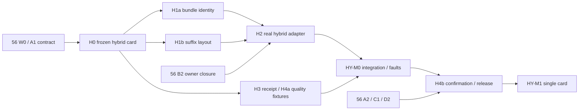

# 57 · GPU / ANE Streaming 接入与交付方案

日期：2026-09-20。复核基线：`feat/stream@8e2e97ed1cef33b0fbd8a954c9f193826ff2846b`。

本文是 [56](56-production-readiness-review-and-acceptance-plan.md) 第 11 节的专项实施附录。**56 第 5–9 节继续管理 GPU 首发与公共基础工作；本文只细化 hybrid 增量，不建立另一套 resolver、scheduler、worker 或发布流程。** 所有新类型、schema、测试 ID、路径、阈值和工期均为拟议；没有新增 runtime 实现、模型实测或发布资格。

## 1. 交付决策与边界

按以下顺序交付，分别签收：

| 里程碑 | 交付物 | 必须证明 | 不需要等待 |
|---|---|---|---|
| GPU M0 | 一个真实 Z-Image adapter 的可靠开发基座 | 来源、布局、输出、失败清理和回归测试闭合 | production catalog、ANE |
| GPU M1 | Z-Image 单设备/shape/内存档位产品 | 56 的 App→worker→verified result→产物事务及发布门全部通过 | 其他模型、hybrid、ANE bank 分页 |
| HY-M0 | 新框架内部 Z-Image hybrid candidate | 同 partition 迁移正确，共享资源无提前覆盖，receipt 完整 | public hybrid record |
| HY-M1 | 一张 public hybrid 支持卡 | 质量、完整请求内存、生命周期、独立证据/record/撤回 | 多 shape、多设备、encoder ANE |
| ANE-BANK spike | ANE 模型组装载/驱逐可行性结论 | 跨多个 denoise steps 的装载成本、峰值、释放与收益 | 不承诺进入产品 |

首个 hybrid 的设计边界：Z-Image Comfy BF16 GPU source、512×512、9 steps、batch=1、固定 token shape、固定 ANE bucket/partition、单作业、无 LoRA、无 encoder ANE、无 GGUF/ConvRot/NVFP4、无自动 route fallback。GPU 计算路径与近似 Core ML 分支共同构成单独 route，不能标记为 exact GPU 数值结果。

K2/G1/D0/Q1 是首次 private smoke 的候选起点；resident block prefix P 和 FFN channel split 由 H0 冻结，**不能直接继承 GPU P7/10 GiB 的内存资格**。用户的目标档位是完整请求目标，不是 GPU slot 容量。
首卡 device、Core ML bundle、OS/runtime 和 target 尚需在 H0 实地确认；当前 `device_optimizations.hpp` 的 suffix 优化匹配 Apple M5 Pro 24 GiB，不等于任意 M5 或 M4 已获得该优化的发布资格。

保留一次性 worker 作为首个产品执行容器。冷启动若使 hybrid 无产品价值，应保留 private candidate 并继续交付 GPU M1；不临时引入持久 ANE 服务来挽救基准。

## 2. 已有能力与新增缺口

| 接缝 | 当前代码事实 | 本次计划 |
|---|---|---|
| Slot / completion | `context.hpp`、`stream_slot_c.h` 已有同步完成和多 reader 协议 | 首版保持 ABI，adapter 内完成 hybrid join |
| Z exact GPU | `ZImageExactAdapter` 使用完整 BF16 block；hybrid 参数为空 | 独立 adapter revision，复用 GPU 基础 owner/lease |
| Z legacy hybrid | `pack_suffix()` 裁剪 w1/w3、打包 w2；`z_block()` 执行 FFN 两分支 | 迁入受计划约束的 source/adapter，保持原实现默认行为 |
| Core ML session | `HybridSession` 预载 branches；多个分支共享 output backing | 首版保持预载与同步边界，加入受验证的 artifact binding |
| Checkpoint provenance | Core ML 构造器要求路径 equivalent；单文件 source SHA 可缺省 | public hybrid 必须改用内容身份；research-only manifest 不直接获得 public 权限 |
| Exact pager 构造 | 当前 lease/exact 构造没有 FFN split 参数 | 新增内部 typed spec；不是使用 legacy budget planner 自动改 P |
| Public validator | 拒绝所有 ANE manifest/approximation | HY-M1 才接独立 route/card；未命中继续拒绝 |
| Campaign quality | 当前 `run_streaming_campaign.py` 只接受 `artifact_sha256_equal` | 增加版本化近似质量 policy；保留原 GPU 策略不变 |
| 发布与 App | 公共闭环问题见 56 R1–R6 | 直接依赖 56 A/B/C/D，不复制另一套实现 |

因此 HY-M0 不能只修改 `require(!hybrid_)`。H0–H4 至少同时覆盖 source、layout、execution、quality、receipt 和 public admission。

## 3. H0：冻结支持卡与三个接口

### 3.1 支持卡字段

拟议 fixture：`tests/fixtures/streaming/z-image-hybrid-v0.json`。开始时是 `draft`，以下字段全部确定后才能标记 `frozen` 并运行 release campaign；未知值不得以 0、空字符串或任意 wildcard 代替。

| 字段组 | 必填内容 |
|---|---|
| Scope | model/operation、512²、9 steps、batch、valid/padded/compute token rows、noise/seed policy |
| Route | `gpu_ane`、approximation=true、encoder route=gpu、VAE route=gpu、禁止的功能 |
| Artifacts | GPU component 内容身份、tokenizer/template、Core ML bundle tree digest、父 checkpoint digest、exporter revision |
| Partition | hidden=3840、MLP width=10240、ANE channels `[0,a)`、GPU `[a,10240)`、32 个 branch 的完整映射、bucket、dtype、output scale |
| Layout | P/G/K/D/Q、pass policy、suffix conversion revision、fixed/prefix/slot 各字段、component lifecycle revision |
| Runtime | 实际 device/RAM、OS build、MLX/Core ML runtime 标识、kernel/optimization profile、worker/container revision |
| Acceptance | quality thresholds/test set、P0/P1/P2 policy、release policy、fault IDs、timeouts、review/evidence references |

`a` 从实际验证过的 artifact 读取并冻结，不在 request 中暴露任意通道数。P 是常驻 block 数，a 是每 block 内的通道数，绝不可共用一个 prefix 字段。

### 3.2 内部接口草案

以下类型可先放在 Z 的内部 header；实现遇到第二个真实 consumer 再抽公共模块。

```cpp
// Proposed internal types, not current public ABI.
struct HybridPartitionSpec {
    uint32_t hidden, mlp_width, ane_begin, ane_end, bucket_rows;
    std::string artifact_content_digest, parent_checkpoint_digest;
    std::string branch_map_digest, precision_revision, scale_encoding;
    std::string gpu_kernel_revision, output_backing_policy_revision;
};
struct GpuSuffixMaterializationSpec {
    std::string parent_artifact_digest, conversion_revision;
    uint32_t first_gpu_channel;
    // Metadata for each fixed/prefix/streamed tensor; no live MLX arrays.
    std::vector<streaming::FieldSpec> fields;
};
// Request-owned noncopyable handle, acquired only by validated installation ID.
class VerifiedCoreMLBundleLease;
```

H0 的三个共享合同：partition/source identity；suffix materialization 与 descriptor；hybrid result/quality evidence。A 线负责 canonical encoding 的定义，H 线消费；D 线使用同一 golden fixture，App 不另写匹配逻辑。
浮点 scale 使用明确 canonical encoding（如校验后的 IEEE 位模式），拒绝非有限值，不能依赖两种语言默认的 float 字符串格式获得一致 digest。

### 3.3 路由准入

Off 请求保持旧入口。新 public 请求分两阶段：

1. 结构校验识别 GPU-only 或显式 hybrid 意图；这一步只允许进入 metadata probe，不能授予执行权限。
2. Native probe 构造完整 workload/artifact/partition 身份，resolver 精确命中独立 record，生成不可由 JSON 伪造的执行 authority；模型构造器校验 authority 与 spec 一致才加载设备资源。

GPU-only 继续要求 approximation=false、两个 ANE manifest 为空。Hybrid 要求 `execution=gpu_ane`、approximation=true、有效 denoiser artifact、encoder manifest 为空；`auto`、缺 manifest、错 bucket、未知 revision、无 record 一律拒绝。options 只返回候选/缺验证/可用状态，不能自行加载 32 个 Core ML 模型。
具体 schema/domain 版本随 56 A2 一次冻结；禁止为赶进度把 hybrid 字段塞进旧 GPU record 而沿用旧 digest。

## 4. H1：来源、派生权重与布局

### 4.1 Core ML artifact 的内容身份和本次绑定

内容身份包含：规范化相对文件列表、每个 regular file 的大小与内容 digest、manifest ABI、父 checkpoint/导出参数、branch map。按相对路径排序，拒绝越界路径、重复键和 symlink；不包含机器绝对路径、inode、mtime。

安装验证时生成已验证的 immutable generation；request 持有 generation lease，更新采用新目录，旧 generation 在全部 request 结束前不替换/删除。模型加载前后验证该 generation 未改变。Core ML 仍按目录路径加载，不能把它描述成 safetensors 的 fd reader；对可变的任意外部目录，先验证并导入受管理 generation，不能只对 manifest 做一次 hash 就宣称所有模型来源固定。

这一合同防范受管理安装的替换/竞态；不是对同权限外部恶意写入者的绝对隔离。发现不一致则 fail closed。若需要更强隔离，应单独设计受保护 artifact store，不能由“持有一个 fd”推导出 Core ML 内部所有读取均受 fd 约束。

`HybridSession` 新增内部的已验证来源输入；public 构造分支从内容证明绑定 parent checkpoint，不再要求旧导出机路径 equivalent。旧 research/legacy 构造保持原行为，不接受新 public authority。GPU 和 ANE 两条 artifact 都必须跨安装重放测试。

### 4.2 Suffix materialization 精确规则

对于每个受 split 的 FFN，hidden=H、intermediate=M、ANE end=a，BF16 每元素 2 bytes：

| 投影 | 原形状 | GPU 形状/读取 | 转换 |
|---|---|---|---|
| w1、w3 | `[M,H]` | `[M-a,H]`，跳过开头 `a*H*2` bytes | 原 fd 连续范围 |
| w2 | `[H,M]` | `[H,M-a]`，每行保留 `[a,M)` | 逐行打包到 private derived fd |

单个 FFN 的 GPU 权重减少 `3*a*H*2` bytes；此值只说明 GPU tensor 容量，不能当作完整请求内存收益。attention、norm、modulation 等字段不裁剪。

覆盖 `noise_refiner.0/1` 和 `layers.0..29` 共 32 个 hybrid branches；`context_refiner.0/1` 保留完整 GPU 权重。noise refiner 属于固定字段，前 P 个主 layers 属于 resident prefix，其余属于 streamed groups。不能只更新 slot 中的 30 层而遗漏 fixed/prefix。

流程：只读 metadata → 编译 suffix descriptor/plan → resolve/freeze → request 内建立 derived fd → 分配 fixed/prefix/pool → 执行。
describe/resolve 不做 packing、不运行 Core ML、不分配 GPU。派生文件身份由 parent content + conversion + tensor ranges 决定，fd/inode 只作为本次绑定；可对打包输出同步计算 digest，成本纳入 setup。

packing 复用现有有限 scratch 分批读写，处理 short read/write、EINTR、取消、磁盘不足和尺寸溢出；成功写满并验证后才发布 Ready source。临时文件保持 private/unlinked，owner 持有 fd；失败路径关闭 fd。不开持久派生缓存，避免增加失效协议。

descriptor 的 source reads、转换、shape、field capacity、resident bytes 和 logical I/O 必须与实际执行一致。分别记录初次 packing 的原文件读/派生写与每 pass refill bytes，不能把前者遗漏或将两者混成稳态磁盘吞吐。
source-generation/actual receipt 如何引用派生 fd，由 H1 在现有 lease/receipt 接缝上实现；只能扩展受验证来源视图，不能重新开放任意 path reader。

## 5. H2：执行、所有权与取消

### 5.1 Request owner

复用 56 B2 的完整 request owner，额外拥有 Core ML bundle lease/session、partition spec、derived source 和共享 input/output lease。Event/cancel/pass tensor 的寿命也必须覆盖未完成工作；不得仅保留 executor，而让它引用的栈变量先离开作用域。

安全结束的依赖顺序：stop dispatch → join I/O → 确认 Core ML prediction 返回且所有 GPU readers/join 完成 → finalize receipts → 销毁 executor/pools 与 views → 释放 hybrid input/output/models、派生 fd/来源 lease。具体 C++ member 排列服务于该顺序，不能仅依赖默认析构“碰巧正确”。

无法证明 drain 完成时，保留整组资源并 poison owner/engine。外层一次性 worker 超过 frozen deadline 时由 56 的 supervisor 回收；进程确认退出前不得宣称资源已释放，也不启动下一 GPU 请求。

### 5.2 Block 映射和调用边界

当前 z_forward 每个 denoise step 先执行两个 noise refiners，再执行 30 个主 layers。hybrid branch ID 分别是 `0/1` 与 `2+layer_id`；context refiners 不调用 ANE。
H2 必须同时接通外层 noise refiners、adapter resident prefix 和 streamed groups；仅在 `encode_group` 传 hybrid 参数会漏掉固定/前缀计算。

首版执行不跨 block 并发：

```text
GPU slot Ready → claim → 可启动下一空 slot 的 I/O
    ↓
GPU attention / normalization → materialize FP16 packed input
    ↓
GPU FFN suffix async submit ─────┐
Core ML FFN prefix sync predict ├→ scale + join + residual → eval
                               ┘                         ↓
                              当前消费者完成 → 发布 slot reader 完成
                                               → 共享 output 可重用
```

不同步掉 FFN 两分支的 overlap；保留 block 末 eval。ANE 不读取 GPU 权重 slot 时，不增加虚假 ANE slot reader。共享 output 的消费者合同由 hybrid owner 单独保证。
`already_complete=true` 只能在实际 block join 完成后设置；“命令已提交”“prediction 返回”“cancel 标志已置位”都不能单独满足此条件。

现有 `compile_gpu` 请求开关与内部 `z_image_hybrid_segments` 优化不是同一概念。首卡冻结内部优化 profile/graph revision，并选用与 legacy baseline 相同的分段实现；不为了接入框架同时改 kernel 或浮点运算顺序。跨平台自动切换分段图会改变 card，必须重新匹配。

### 5.3 状态与失败矩阵

| 状态 | 本次资源 | 取消/失败动作 | 是否可宣布清理完成 |
|---|---|---|---|
| Probing | metadata、内容证明 | 终止 probe，释放读取句柄 | 无设备工作时可以 |
| Packing / Loading | 部分派生 fd、部分 Core ML branches | 停止新增工作，等待已进入的同步调用返回，清理已创建资源 | 仅确认无 pending 工作后 |
| BlockInFlight | GPU suffix、Core ML input/output、join | 不再提交下一 block；等实际消费者结束 | 不能仅看 cancel flag |
| Draining | I/O、GPU、callback、session | 收集 primary/cleanup errors，完成或隔离 | 所有资源依赖有证明时 |
| Quarantined | 完整 owner 和相关句柄 | 不复用、不析构不安全 backing；由 worker 退出处理 | 退出被确认之后 |
| Completed | receipt 已验证，输出尚待产品事务提交 | 走 56 的 staging/rename/JobStore 流程 | 不能只凭图片存在成功 |

首版 ANE load/predict 失败均不静默 fallback。错误稳定区分 artifact mismatch、unsupported bucket、packing I/O、prediction failure、cancelled、drain unproven；精确错误码由 H0 与公共 error mapper 一次定义。日志不包含 prompt 或完整私人路径。

## 6. H3：实际执行证据与资源计量

本节 H3 是工作包编号，不指 H3 模型。

### 6.1 Hybrid component receipt

GPU slot receipt 继续由真实 fill/encode/completion 产生。新增拟议的 `HybridComponentReceiptV1` 作为 result 的版本化 component 扩展，经 common verifier 校验后绑定到顶层 verified result；不能只在 telemetry 写 `hybrid=true`。

必需字段：request generation、partition/artifact/bundle binding identity、实际 backend 配置、输入 bucket/valid rows、dtype/scale、branch map、按 pass/block 的 runtime prediction 完成与 join 完成、failure latch、final drain。实现可预分配有界记录数组，数量由 steps×32 确定；warmup 单独计数。
9-step 首卡应有 288 次成功 runtime branch 调用，包括 18 次 noise refiner 和 270 次主 layers，且每条成功调用都有相应 join 完成。**预期计数是 verifier 检查项，不能据预期反向合成实际记录。**

v2 stage/v3 execution receipt 不需要为此强行改 C slot ABI；component schema、canonical domain 与 result verifier 必须升级并保留旧 GPU-only 兼容读取。未知 component revision、重复/漏 branch、wrong generation、未经证明的输出 reuse 均拒绝 public 成功。

采样/质量可以证明 route 使用该 Core ML artifact，但不能凭 288 次成功调用证明纯 ANE 硬件利用率；若产品要宣称 ANE 实际驻留/利用率，另采可信设备执行证据。

### 6.2 内存和时间分账

| 资源/阶段 | 静态是否可精确算 | 必须记录 |
|---|---|---|
| GPU fixed/prefix/slots | tensor backing 可算 | 计划 bytes、实际分配、释放边界 |
| Packing | scratch 和派生文件逻辑大小可算 | 读写 bytes、临时存储需求、setup 秒数、取消回收 |
| Core ML 模型/runtime | 不能只由 `.mlmodelc` 文件大小推出 | load 前/后、首次 predict、稳态、release 后的观测 |
| Input/output/padding | 自有 backing 可算 | 有效 rows、bucket rows、复制 bytes、alias 生命周期 |
| Text/denoise/VAE/export | 随 shape、runtime 变化 | 完整请求峰值及峰值阶段、组件切换重叠 |
| Worker / App | 完整树可测 | job correlation、采样完整性、worker 退出；App 常驻成本另外报告 |

沿用完整 process-tree phys footprint 采样与系统内存/swap 观测；Core ML 如有未纳入树的系统服务开销，应说明覆盖限制，不能称“整个系统 ANE 内存均被计入”。未知 native/runtime 分配不记为 0、不承诺 hard cap。P2 沿用 target headroom 与完整环境要求，不降低 buffer。

至少报告 `startup/load/pack/first_predict/denoise/vae/export/request_wall`。每个 block 近似为 `pre + max(gpu_suffix, coreml_prefix) + join`，这只是诊断模型；共享内存带宽、padding 与调度会改变实际 overlap，以 trace 和完整 wall time 为准。

## 7. H4：质量、性能与发布工具

### 7.1 三种对照不可混用

| 对照 | 问题 | 质量规则 |
|---|---|---|
| 新 GPU-only vs 已冻结 GPU reference | 框架/基础修复是否改变原算法 | 保留现有 exact artifact/canonicalizer 规则 |
| Common hybrid vs 同 partition/reference executor | 迁移是否漏算、错读、改变生命周期 | 优先 byte-exact；先验证参考路径自身确定性，不稳定时在正式样本前冻结 tensor tolerance |
| Hybrid vs exact GPU | 近似计算是否满足产品质量 | 独立 paired numerical/image policy，不要求哈希相等 |

Legacy budget 路径若不能固定到相同 P/G/K/D/Q、split、graph、component retention，不能直接称为 same-plan P1。先增加 private reference harness，复用同一 source/spec/kernel 而使用既有顺序执行；其与 common adapter 的 identity 必须可审计。Legacy 原样 E2E 仍保留为诊断对照。

### 7.2 质量 policy 的工具改造

拟新增 `paired-numerical-image-v1` policy：固定 noise/seed、尺寸、prompt/token shape、sampler/steps、参考 route、metric implementation revision、阈值、样本集和聚合规则。
复用 `tools/native/quality_gate.py` 的 RGB correlation/cosine/MAE；latent 指标使用明确的 dtype、flatten/normalization 和零范数规则。正式 verifier 从被 digest 绑定的原始产物/metrics 与 policy 重新判定，不能只信 runner 写的 `passed=true`。

建议的**待 H0 冻结起点**：每对输出必须 shape 一致、所有中间/最终数值有限；RGB correlation≥0.99、RGB cosine≥0.995、MAE≤2.55（0–255 范围）；final latent relative-L2≤0.05、cosine≥0.995。该阈值是工程提案，不是已有 Z qualification，也不是所有模型通用标准。
先使用独立 exploration prompts 检验这些指标能发现错 scale、错 branch、漏 prefix 等故障，再冻结 confirmation prompts/seeds 和阈值。单张失败不得被均值覆盖，人工检查所有 confirmation 对照图，明显结构/文字/颜色缺陷即使指标通过也阻断。调整阈值必须生成新 policy 并重新进行独立 confirmation，保留原失败。

工具修改位置：`run_streaming_campaign.py` 校验/采集新 mode；`verify_streaming_campaign.py` 独立重算；`build_streaming_catalog.py` 拒绝错 route/policy/缺质量证据；`prepare_streaming_release_policies.py` 生成显式 hybrid 策略。新增模式不能改变旧 GPU policy 或让未知 mode 默认通过。

### 7.3 正式实验与发布条件

先 host → private smoke → failure tests → quality confirmation，再冻结 final build 运行长测。沿用 56 的默认路径回归、same-plan P1 和完整 P2；strict/calibrated 发布策略按 56 §5.3 预先选择，新 calibrated 尚未实现前不能跳过原 strict gate。

区分三个 verdict：`correctness_qualified`、`memory_calibrated`、`performance_qualified`。前两项通过但完整请求无收益时，仅保留可评估 candidate，不自动推荐为加速路线。
首个“加速”产品卡建议额外要求同容器 exact GPU 对照的完整 wall median ratio 95% CI 上界≤0.95、wall P95 ratio 上界≤1.05；这是拟议收益门，不替换现有 same-plan P1 开销门。若目标改为节省内存，需要在 H0 明确不同产品声明和可接受速度 tradeoff，不能事后把速度失败改名为成功。

Cold worker 对 cold worker，resident warm 对 resident warm，环境完整且设备作业独占。沿用 20 matched pairs/10 ABBA blocks 作为正式性能起点；quality 集和 timing 集分别冻结，timing 样本同样检查质量。统计 INCONCLUSIVE 按预注册规则处理，不无限追加到 PASS。

发布 record 绑定 artifact/partition、GPU plan、quality policy、component receipt verifier、device/OS、container 和 release policy。App 只展示 native 匹配结果，明确近似计算许可；失配显示原因，不悄悄关闭 ANE 或选择 GPU record。撤回 hybrid record 后 GPU record 仍可用，下一请求重新 resolve。

## 8. 可直接拆分的 PR 和并行工作

H0–H4 与 56 §11 的编号一致；每个工作包可以分数个小 PR。以下是熟悉代码人员的净工程估算，不包含 artifact 获取、未知设备问题和正式长测等待。

| 包 / PR | 文件与实际改动 | 前置 | 最小验收 | 估算 |
|---|---|---|---|---|
| H0 | 支持卡、partition/quality/component 契约、canonical golden fixture | 56 W0 的公共契约 | 所有必填项 frozen；对应 reject fixtures | 0.5–1 日 |
| H1a | `coreml.hpp/.mm` 的 verified bundle 构造、安装 generation、跨路径内容匹配 | A1/A2 identity 接口、H0 | 原样复制可匹配；变更内容/manifest/parent 拒绝 | 1–2 日 |
| H1b | Z descriptor、weight stream typed split、lease-backed packing、fixed/prefix/suffix 一致性 | H0，H1a 可并行 | tiny tensor 的切片 bytes、容量、溢出、EOF/ENOSPC | 1–2 日 |
| H2 | Z hybrid adapter/owner、noise refiner 与 prefix 接线、同步 join、取消/隔离 | H1a/H1b、56 B2 | 同 partition smoke、延迟消费者/fault、10 次生命周期循环 | 2–3 日 |
| H3 | component receipt recorder/verifier、采样分账和 setup 时间 | H0；接实测需 H2 | forged/missing/duplicate receipt 拒绝，峰值覆盖完整 | 1–2 日 |
| H4a | numerical/image campaign/verify/builder mode 与 fixture | H0，可与 H1/H2 并行 | 旧 policy 不变，NaN/错阈值/伪造 passed 拒绝 | 1–2 日 |
| H4b | route 精确准入、options/App、record/package/revoke、正式确认 | H1–H3、H4a、56 A2/C1/D2 | HY-M1 全部测试与独立 review | 1–2 日 + campaign |

建议三条增量线：source/layout（H1）、runtime/lifetime（H2）、evidence/quality（H3/H4a）。H0 后可以先用 fake branch 编写 H2 测试；真实接线等待 H1。H1a/H1b 若同一人负责顺序完成，工期不能因表中“可并行”自动减半。



`z_image.cpp`、Core ML constructors、canonical schema 和 public validator 各指定一个合并负责人，其他工作通过冻结接口提交；独立 checkout/build 输出避免覆盖证据。CPU fixture/工具测试并行，实机 GPU/ANE 性能测试同机串行。
三名熟悉代码开发者且 artifact 已可用时，可把 HY-M0 规划为 H0 后约 4–6 工作日的集成目标，HY-M1 再留 2–4 工作日与测量窗口；不是实测完成承诺，也不叠加到 GPU 首发的关键路径。

## 9. 测试 ID、证据与停止条件

所有测试 ID 为待实施项，不能列入当前 PASS。

| ID | 场景 | 必须观察到的结果 |
|---|---|---|
| HY-ID-01 | 相同 checkpoint/bundle 复制到另一安装 | 内容/layout 身份稳定，本次绑定独立 |
| HY-ID-02 | 同大小改内容、改 scale/branch/parent、路径越界 | resolve 或 load 前拒绝，不生成成功结果 |
| HY-SRC-01 | load 期间 generation 替换/外部目录修改 | 不加载混合 generation；失败且无旧 lease 冒充 |
| HY-MAT-01 | tiny w1/w2/w3、a 边界、fixed/prefix/slot | 与独立切片 oracle 逐元素相同，capacity 精确 |
| HY-MAT-02 | packing EOF/short write/ENOSPC/取消 | 未完成 source 不可执行；fd/临时存储被回收 |
| HY-MAP-01 | 2 noise + 30 main × 9 steps | branch/step/rows 全匹配，无遗漏/重复，warmup 不混入 |
| HY-LIFE-01 | 人为延迟 GPU join，尝试下一 branch | 共享 output 不被覆盖，slot 不提前复用 |
| HY-LIFE-02 | predict 报错/阻塞、取消时 GPU pending | 无静默 fallback；完整 owner 安全 drain 或隔离 |
| HY-LIFE-03 | 10 个 one-shot jobs；测试 harness 内 10 次构造/销毁 | 可回收资源无泄漏趋势；不能用进程退出掩盖内部提前 free |
| HY-REC-01 | 重复/漏 receipt、错 generation、伪造计数 | common verifier 拒绝 public success |
| HY-QUAL-01 | 相同 hybrid reference 与 common route | frozen migration rule 全通过 |
| HY-QUAL-02 | hybrid vs exact GPU，注入错 scale/漏 branch | 正常样本满足 frozen quality；注入故障被检出 |
| HY-TOOL-01 | NaN、缺原始产物、篡改 passed、未知 policy | verifier/builder 拒绝；旧 GPU fixture 继续通过 |
| HY-MEM-01 | cold load/pack/predict/denoise/VAE/worker exit | 采样覆盖全程，P2 与 headroom 通过或明确未通过 |
| HY-PERF-01 | same-plan 与产品 E2E 分开比较 | 各自 baseline/CI 完整，不能混用 cold/warm |
| HY-APP-01 | 修改 artifact/bucket、乱序 options、旧 result/产物 | 重新 resolve，错 request/record 不提交 job 成功 |
| HY-REL-01 | release package、test hooks、record 撤回 | 无测试后门；撤回只影响该 card，GPU 卡保持有效 |

HY-M0 的 smoke：2 个冻结且处于同一支持 token shape 的 prompts × 3 seeds，与 reference 成对跑；这是快速阻断，不替代质量 confirmation。推荐质量 confirmation 至少 6 个独立 prompts × 3 seeds，覆盖纹理、人物、文字、颜色与复杂构图，在 H0 固定，所有样本仍须满足 card token shape。
外部未支持 shape 测试期望明确拒绝，不把它伪装成更多形状已通过。

证据复用现有 campaign bundle，新增版本化 `hybrid-card.json`、`hybrid-source.json`、`hybrid-receipt.jsonl`、`quality-policy.json` 和质量原始产物索引；由既有 manifest 完整引用并绑定 digest。文件名和 schema 在 H0 冻结，未知扩展字段不能默认授予资格。
最终 review 必须逐项核对 artifact→resolved plan→实际 component receipt→quality→process tree→产物 job 的关联，而不是分别查看几张 PASS 截图。

停止条件：来源不可固定、共享 backing 无法证明安全、质量失败、正式峰值超档、同步调用无法隔离、无同口径 baseline，任一出现即停止扩大范围。先保留 GPU M1；不降低内存余量、不改判失败、不扩大自动 fallback、不新增未验证 shape 掩盖当前问题。

## 10. ANE model bank streaming 的独立可行性实验

这部分不是 HY-M1 的前置，也不是当前 GPU slot 的直接后端替换。Core ML model handle 的加载/内部内存由现有 Core ML 路径管理，不能把编译目录字节写进 GPU slot 就认为模型可执行。

Spike 时间盒建议 2 个工程日，前提是现有 2–4 个 block artifacts 可运行。固定同 device/OS/bucket/input，先测试：

| Variant | 应用持有的模型 | 目的 |
|---|---|---|
| B0 | 所选 blocks 全部预载 | 小规模 reference |
| B1 | 单 bank 按 block 串行加载/释放 | 观察最低对象驻留与反复 load 成本 |
| B2 | 双 bank；当前 predict 时预取下一个 | 观察能否隐藏 load，代价是重叠峰值 |

每种 variant 至少覆盖 9 次模拟 denoise pass，记录冷启动和后续循环；先 3 次探索复跑，只有方向成立才冻结独立确认。明确区分销毁对象时间、观测 footprint 下降时间与未知缓存保留；不以对象引用归零声称物理内存立即归还。
若尝试后台 Core ML load，需专门验证所选实现的并发约束和资源开销；不能把任意 Core ML/MLX API 塞进现有只负责 pread 的 I/O worker。

阶段性 go 条件：数值/生命周期全部通过、观测峰值相对 B0 的差异大于预注册测量噪声范围、且按实际 schedule 估算有机会达到 H0 的完整请求预算和速度目标。micro go 只授权扩展到全部 32 branches 的完整请求实验，不能直接发 record。
若 B2 重叠峰值抵消收益、每 pass reload 占主要耗时或释放不可预测，给出 no-go/INCONCLUSIVE 及原始证据，继续使用 resident ANE + streamed GPU 或 GPU-only；到时间盒即交付结论，不无限搜索。

只有全模型实验有价值后，再立项 model cache/preload queue/eviction lease。暂不引入常驻服务、跨作业共享 ANE cache、动态分区或通用异构 DAG scheduler。

## 11. 下一次实施的前 48 小时

1. **前半天：56 W0 优先。** 固定 GPU M0/M1 card、来源/worker/error 三个合同；把 R1/R2 变成正式回归，选定最终执行容器和发布策略。
2. **当天下半天：GPU 四线开工。** A 修身份，B 修 Z source/owner，C fake worker/事务，D preflight/回归；运行轻量基线。有限人员先保证 GPU B 线，不同时承担 ANE adapter。
3. **有额外并行人员时启动 H0。** 盘点实际 Core ML artifact、确认 device/bucket/split、冻结三接口，写 tiny suffix 与 fake prediction/join 测试。没有 artifact 就只交付 fixture/contract，不填 qualification。
4. **第二天：做最早的真实集成。** GPU 先打一条完整输出/取消链；hybrid H1 与 H4a 可并行，H2 先在 fake branch 验资源协议。当天报告按代码实现、host 测试、真实 smoke、发布资格四列分别标状态。

后续每次合并只增加一个可验证能力；每个 milestone 都保留可运行基线和独立 record 撤回能力。本文不创建任务、不运行 campaign；实施开始后在 13 记录代码与证据，在 56 更新总体阻断，在本附录更新对应 H 包完成状态。


## 12. 2026-09-21 编码器完整请求探索更新

[实验第三十五、三十六轮](../../experiments/2026-09-20-m1-streaming.md)补充了 legacy Z-Image encoder 分流的完整图片证据。75%/50%/25% INT8 FFN 在各两对冷 worker 样本中，完整请求分流/GPU wall 中位数比为 1.164/1.241/1.240，均无收益；三个比例 final latent relative-L2 均超过预先冻结的 0.05。此前局部暖态 encoder 加速不能用作完整请求性能资格，也不能由此确定一般最优比例。

代码已在 legacy streaming 的 encoder/denoiser 边界同步并释放 encoder 会话，缓存 conditioning 保留来源指标；同 engine 首次分流→缓存命中→切回 GPU 的真实模型回归通过。这只证明正常完成路径的 native owner 释放，不证明 Core ML 服务缓存驱逐，也未关闭故障/取消 drain。该实验未实施本文 HY-M0 denoiser 接入：typed bundle/source partition、suffix materialization、共享 backing join、实际 component receipt、质量准入和 public routing 仍待完成。两个目标模型 explicit streaming + encoder ANE 的拒绝保持不变；Flux legacy streamed 路径不支持，本轮没有 Flux 完整分流图片。


## 13. H1 权重后缀转换实施进度（2026-09-21）

已新增内部 `z_image/suffix_materialization.hpp/.cpp`，将 legacy packer 的几何计算和 down-projection 按行打包提取为无 MLX/Core ML 依赖的共享组件。`suffix_geometry()` 只计算 metadata；`pack_suffix_rows()` 只使用调用方持有的 source/destination fd，采用至多 4 MiB scratch，验证文件范围、整数上限和不同 regular file，处理 EINTR/短读写/EOF/零进展/取消，并累计实际 I/O（含失败前已完成部分）。调用方仍负责 private destination 生命周期、source lease revalidation 和失败时禁止发布。

现有 `ZImageWeightStream::pack_suffix()` 已复用同一组件，保留 2 个 noise refiners + 30 个主 layers 的映射、context refiners 不裁剪，以及 ConvRot 对齐/scale 规则；dtype/几何在创建临时文件前检查。此变更未开放 M1 上 legacy denoiser suffix 的设备限制，也未为新框架添加 public hybrid authority。

`test_z_image_suffix_materialization.py` 的独立字节 oracle 验证 BF16/I8、首通道/中间/末通道、非零文件偏移、多 scratch 批次，以及确定性的 EINTR、短读写、EOF、ENOSPC、取消和重试；故障注入只通过 host 测试对象的 syscall 符号重命名实现，不加入生产 hook。ASan/UBSan 通过。对应 HY-MAT-01/02 的转换子项有证据，但 fixed/prefix/slot descriptor 的完整 hybrid 接入、derived-source identity、Ready 发布与完整 owner 仍未完成，所以不能将这两个测试 ID 整体标记通过。
