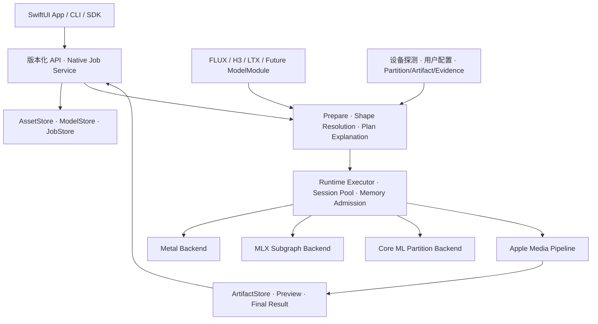

# TurboCider 统一多模态原生框架设计

> 当前项目已经实施重构；以下为此前设计及待完成目标。现行目录/旧代码退役见 [项目重构](project-restructure.md)，真实能力见 [实现状态](rewrite-implementation-status.md)。
状态：设计提案，2026-09-05。本轮只阅读现有实现并修改设计文档，不修改运行代码、不启用设备策略、不下载模型。

本文是后续整体重构的主设计。模块职责与性能生命周期进一步见 [模块、产品与高性能运行时详设](runtime-modules-and-performance.md)。此前 `native/` 中真实 FLUX 纵切提供数学与接口测试基线，不直接作为最终通用框架继续堆模型。此前总体架构和实施记录保留为背景与证据；涉及通用输入、模型模块、设备策略和系统服务的后续设计以本文为主。

## 1. 产品定位与关键决策

TurboCider 是运行在 Apple Silicon 上的原生多模态推理平台：App、CLI 和 SDK 发起同一种任务；模型模块描述数学与输入语义；平台统一处理素材、计划、设备、内存、执行和结果。

需要形成三个独立的扩展轴：

- **模型扩展**：加入新模型、checkpoint、LoRA 或新 operation，主要修改对应模型模块与数据包。
- **计算扩展**：加入 Metal kernel、MLX 子图或 Core ML partition，主要修改 backend/partition provider，不让 App 知道算子细节。
- **产品扩展**：加入图片编辑、参考图、视频首尾帧、音频输入或新 SDK，不改变底层设备实现。

首要设计决定：

1. 统一输入和结果协议，而不是要求所有模型采用相同的 Transformer、sampler 或 VAE。
2. 以 ModelModule + Operation + Recipe 接入模型；以 Backend + ExecutablePartition 接入计算。
3. 以两级图表达模型阶段和可调度计算分区，不开始就开发覆盖所有神经网络的通用编译器。
4. GPU/ANE 是按设备、模型身份、operation、shape 和 artifact 确定的执行策略；用户配置控制候选策略是否启用。
5. App/CLI 默认连接同一用户级原生服务，由服务统一资源准入。保留 embedded library 用于 SDK 与测试。
6. 模型包、机器策略、编译产物和本地路径分开存储，不再放入一个混合 JSON。
7. 图片、视频、音频是有身份、有顺序、有时间语义的输入资产，不是附加几个可选文件路径。

## 2. 从旧代码得到的具体结论

本轮读取了旧 `models.py`、`runtime.py`、`policy.py`、`device.py`、三模型 adapters、runner/jobs/service/model_management，以及 Swift App/SDK、model-packs 和 device-profiles；同时对照 H3 Core ML、LTX MLP split 接口和 FLUX config。

| 现有代码 | 应保留的能力/意图 | 需要重构的问题与归属 |
|---|---|---|
| `src/turbocider/models.py` | inputs/output/sampling/policy，图片角色与有序输入 | 通用层按图片数量推断模型模式、全局强制 prompt、task=单一输出类型，限制未来模型；拆成 InputBundle、OperationSchema、OutputBundle |
| `src/turbocider/runtime.py` | prepare、能力验证、计划解释 | 最终 prepare 产物是 CommandSpec；重写为不可变 PreparedPlan，绑定模型图、执行分区、shape、内存与输入身份 |
| `adapters/base.py` 与三模型 adapters | 真实模型参数、输入语义、旧能力迁移清单 | 核心抽象是 build_command，且可传额外 args/env；迁移为模型 library 接口，环境变量不再决定正式数学路线 |
| `policy.py` | GPU/ANE 候选、精度限制、不可用原因 | 固定 priority 不反映冷/暖和复制代价；显式 GPU_ANE 跳过设备 profile 匹配，prepare 才记录 forced；新设计始终执行硬兼容检查 |
| `device.py` + `device-profiles/` | 机器探测与匹配 | 当前只有 M4 Max 40-GPU/64-GB profile；硬件 fingerprint 不含 OS build。拆分稳定 HardwareKey 与带 OS/runtime 的 ExecutionEnvironmentKey |
| `model-packs/*.json` | 能力、权重准备与路线可发现性 | 混合本地 Python/可执行路径、下载来源、env、设备验证和模型语义；拆包，保留 provenance |
| `runner.py` | 常驻执行、取消与进度传递 | 子进程/日志解析不构成统一推理 runtime；由 RuntimeExecutor 的事件、完成句柄和取消点替代 |
| `jobs.py` / `service.py` | 队列、持久化、HTTP 作业、事件与取消 | 原生 JobService 重写；数据库只保存作业/计划/资产身份，不保存可执行 shell 命令作为任务定义 |
| `model_management.py` | 导入/下载/转换/编译/检查的产品能力 | 从生成服务拆成 ModelStore 与 PreparationService；安装和编译任务有独立资源预算，不在生成中隐式触发 |
| Swift `AppModel.swift` / `ContentView.swift` | 首尾帧、参考素材、模式切换、历史和预览 | 仍有 contains("flux") 和模式 switch；由 capability schema + 通用素材编辑器驱动，特殊模型规则交给服务 |
| Swift `Daemon.swift` | 用户无需手工启动服务 | 当前依赖定位 Python 项目并启动服务；替换为原生服务安装、发现、握手和生命周期 |
| 新 `native/core/runtime.hpp` | 已验证的 C ABI、取消、FLUX 数学与流修复 | `tc_engine` 硬编码 Flux，Tensor 直接暴露 MLX，Request 仅 prompt；同样需要按本设计拆分，不能成为另一个 FLUX 专用框架 |

旧系统已经声明/接线的输入能力包括：FLUX init_image、ordered reference edit；LTX 单 first_frame；H3 first/last、reference image/video/audio、视频外部音轨及嵌入音轨开关。这里是源码能力盘点，不把声明视为新原生实现已验收。

旧 H3 `balanced` 中 layers=45/reuse=2，以及 LTX `preview` 中 text rows=256、近似 attention 都会改变算法。它们应成为显式 ApproximationSpec，不能混进“换设备加速”的设置。

## 3. 目标代码结构与依赖方向

以下是目标目录，尚未迁移。建议明确选择一个新主树，最终删除旧 Python 调度路径；不要长期保留两套正式 App、两套 schema 和两套任务系统。

```text
TurboCider/
  CMakeLists.txt                   原生库、模型模块、CLI、测试
  Package.swift                   Swift SDK 与 Apple 产品层
  apps/macos/                     SwiftUI Workspace / Composer / Library / Settings
  apps/cli/                       原生 CLI，daemon client；可显式 embedded
  services/turbociderd/            用户级作业服务，XPC/本地 socket transport
  bindings/
    c/                            versioned C ABI，opaque handles
    swift/                        async typed SDK + transport
    python/                       后续薄 binding/client；非引擎运行依赖
  schemas/                        API、model、profile、artifact、result 的版本化 schema
  core/
    contracts/                    Request、InputBundle、Plan、Event、Result、Error
    assets/                       AssetStore、身份、生命周期、派生素材
    models/                       Registry、ModelModule 接口、ModelStore
    planning/                     ShapeResolver、Recipe、PartitionPlanner、PlanExplainer
    runtime/                      Executor、Scheduler、Cancellation、SessionPool
    memory/                       Storage、BufferLease、WorkspacePlan、Admission
    artifacts/                    ArtifactStore、验证、编译缓存
    telemetry/                    Trace、数值 dump、延迟/内存/设备记录
  backends/
    metal/                        Device、command/event、kernels、kernel registry
    mlx/                          整子图兼容和迁移，内部拥有 MLX Tensor
    coreml/                       公开 Core ML、manifest、shape bucket、completion
    cpu/                          预处理、小算子、诊断参考
  media/apple/                    ImageIO、CoreVideo、AVFoundation、音视频导入导出
  model_modules/
    flux2/                        config/operations/conditioning/DiT/VAE/partitions
    h3/                           FL2VA、Ref2VA、refiner、AV DiT、decode/partitions
    ltx/                          Gemma/connector、双阶段、upsample、AV decode/partitions
  model_packs/                     模型/变体/权重映射/operation 描述，无本机绝对路径
  profiles/                       设备匹配与候选 policy；不内嵌数学实现
  tools/                          离线 importer/exporter/calibration/benchmark
  tests/                          contracts、backend、model、media、service、App
  docs/design/
```

- Core contracts 用 C++，不导入 SwiftUI、Foundation 或 MLX。Apple API 实现置于 Objective-C++/Swift 边界。
- 模型模块只依赖 core 与 backend 抽象；不得依赖 App、HTTP、任务数据库。
- 服务只依赖模块接口与运行时，不写 `if model == h3` 的数学规则。
- SwiftUI 只依赖 Swift SDK 和媒体呈现，不直接绑定 Metal buffer。
- C ABI 不暴露 `std::vector`、MLX array 或 Objective-C 对象；文本/句柄/张量视图均有明确所有权。
- 基础实现用 C++20、Swift Concurrency，Apple 框架提供媒体/系统集成；MLX 版本固定。CMake/SwiftPM 是后续正式构建目标，本轮没有安装或切换工具链。

## 4. 完整系统：控制与执行分离



默认使用原生 GPU；用户启用配置后才允许选择 hybrid/auto 候选。默认一个用户级服务持有 GPU/Core ML sessions，App 和 CLI 共享准入；这样 App 中生成视频时，CLI 不会在另一个进程无条件再加载一套模型。首版限制一项大模型 generation 活跃，允许低资源素材探测等并行，之后再按实测预算扩展。

App 使用 XPC transport；CLI 可经同一服务的本地 socket 客户端进入相同 ApplicationService。HTTP 是可选 transport，初始仅 loopback，采用 token 与资产句柄；不得把任意客户端绝对路径当作服务可访问素材。HTTP 不单独实现一份调度逻辑。

XPC 服务或用户级 helper 的具体打包方式需要专门的跨进程、后台存活与权限 spike；CLI 任务应能在 App 退出后继续。不要直接采用随 App 退出即终止的进程所有权。

Embedded SDK 调用同一 core，但资源仲裁只对本进程有效。通过设备执行 lease 与 daemon 协调，无法协调时明确 busy/standalone policy，不声称一个 mutex 能保护所有进程。

## 5. 多模态输入：资产、角色、操作三层

### 5.1 AssetRef 是内容身份，InputBinding 是用途

`AssetRef` 包含 content hash、media kind、原始文件元数据和服务端 asset ID；文件位置与 security-scoped bookmark 属于存储/权限层。`InputBinding` 包含 role、asset ID、顺序、时间范围、绑定目标及模型定义的参数。一个资产可在不同请求承担不同角色。

输入容器保留完整顺序，不能先按 image/video/audio 分类再拼回；H3 混合参考和 FLUX reference 顺序会影响 conditioning。`frame_index` 改为明确 time reference（目标视频的帧索引或有理数时间），帧编号从 0 开始，FPS 使用有理数，避免 29.97 等值被 int 截断。

角色有共享词汇，但由 operation 声明允许组合：prompt、init_image、reference、first_frame、last_frame、mask、control、reference_audio、reference_video。支持角色不意味着支持任意组合或任意个数。H3 首尾帧与参考模式互斥属于 H3 规则；LTX 单首帧属于 LTX 规则。

通用层不强制 prompt 非空；各 operation 决定 text 是否必需。未来纯图像超分、音频变换等不应为了通过校验而制造一条空用途 prompt。

### 5.2 请求草案

下面是拟议 schema v2 示例，不是当前可执行请求：

```json
{
  "schema_version": 2,
  "model": {"id": "flux2-klein-4b", "revision": "model-lock-id"},
  "operation": "image.edit",
  "inputs": [
    {"kind": "text", "role": "prompt", "text": "保留人物，将背景改为雪山"},
    {"kind": "image", "role": "reference", "asset_id": "asset-person", "ordinal": 0},
    {"kind": "image", "role": "reference", "asset_id": "asset-background", "ordinal": 1}
  ],
  "outputs": [{"kind": "image", "width": 768, "height": 512, "format": "png"}],
  "sampling": {"seed": 42, "recipe": "default"},
  "execution": {"policy": "auto", "profile": "local-default", "approximation": "none"},
  "parameters": {}
}
```

`parameters` 由模型 operation 的版本化 schema 校验，拒绝未知键，不接受任意 env/args。steps/guidance 等只能在该 operation 支持时覆盖；LTX 双阶段 schedule 不被一个全局 steps 任意覆盖。对新音视频模型，outputs 可包含关联的 video/audio/字幕等，mux 指定哪些资产组成最终容器，避免当前 task 单一类型限制。

`mode=auto` 只作为交互便利：由选定模型的 operation resolver 判断；有歧义就给出可选操作，prepare 结果必须变成明确 operation，不能在 core 中凭图片数量做全局推断。

### 5.3 图像输入的完整处理链

文件选择/拖放 → 权限获得 → 文件探测与导入 → 内容身份 → EXIF orientation/ICC/alpha 等处理 → operation 专属 resize/crop/normalize → vision encoder 或 VAE encoder → conditioning/初始 latent → 采样 → decode/export。

平台负责安全读取、媒体解码、方向/色彩信息、原始资产保留、尺寸检查和派生资产存储；模型模块负责最终 tensor 布局、插值、归一化范围、patch、VAE latent、image token ID、mask 和 strength 的数学语义。不能对所有模型统一做一次 JPEG 压缩或同一 resize。

旧 LTX worker 含首帧 MP4 roundtrip/CRF 处理。新原生路径必须先复现该参考的像素预处理，再把去掉有损 roundtrip 作为显式 recipe revision 单独比较；不能未经验证“优化”掉它并声称相同输入。

导入默认生成受管理、不可变的资产副本或有身份验证的存储引用；不修改用户原图。只存路径会使文件变更后缓存继续误命中，也会使服务重启后失去访问权。大视频可采用受控引用，但运行前检查内容身份和访问 lease。

### 5.4 缓存身份

conditioning key 至少包括：模型/adapter hash、operation/recipe revision、tokenizer/template、所有有序输入 hash+role、crop/resize/color/时间采样参数、dtype/quantization、文本长度和 mask 规则。

可分层缓存文本、图像 VAE、vision embeddings、静态 text K/V；不是把所有内容都塞进一个 prompt cache。换 reference 顺序、first frame、strength、LoRA 或处理参数都必须失效相应派生层。采样 latent、RNG 和可变 KV 属于 job workspace，不能在任务间共享写入。

## 6. 模型扩展契约：新增模型改哪些地方

### 6.1 ModelModule 与 ModelPack 分离

ModelModule 是可执行代码，提供架构族的数学实现；ModelPack 是数据，声明某个 checkpoint/变体的权重、配置、operation、参数范围与依赖。新 checkpoint 若数学结构已支持，主要新增 ModelPack；新 architecture 必须新增实现，不能承诺只写 JSON 即可执行任意模型。

拟议接口职责：

| 接口 | 输入 → 输出 | 约束 |
|---|---|---|
| describe | 模块版本 → OperationSchema/组件列表 | 无模型加载，无 UI 依赖 |
| inspect | ModelPack + LocalModelLock → 完整性/ready 状态 | 检查组件身份；不下载 |
| validateAndResolve | InputBundle + operation params → ResolvedInputs/ShapeSignature | 模型自己的角色组合、mask、crop、token 与时间关系 |
| buildRecipe | ResolvedInputs + SamplingSpec → RecipeGraph | typed ports、循环状态、条件依赖、可分区位置 |
| partitionCandidates | RecipeGraph + shape → 数学等价或显式近似候选 | 只描述合法拆分，不自行探测机器或改 env |
| createSession | ComponentResolver + RuntimeServices → ModelSession | weights/session 与 job mutable state 分开 |
| bindExecutable | 已选择的 PreparedPlan → executable stages/partitions | 不在执行时偷偷替换 profile |
| validateResult | artifacts + execution trace → 模型结果检查 | 真实 shape、媒体同步、finite、必需输出 |

接口首先是内部 C++ 契约，v1 模型模块静态链接注册。以后需要外部扩展时再引入受版本约束的插件 C ABI；一开始不加载任意第三方 dylib。模型数据包不能包含任意执行脚本。

### 6.2 两级图与复合任务

**RecipeGraph** 表达 tokenization、text/vision/VAE encode、denoise loops、upsample、video/audio decode、mux。typed port 声明 logical shape、dtype、layout、mask、timebase、可变性和生命周期。

**ExecutionGraph** 表达每个 recipe stage 内已选择的 partitions、pack/copy/quantize、GPU/Core ML dispatch、join、barrier、release。存在循环携带状态（latent、RNG、mask），不是只支持一次性的无状态 DAG。重复 block/step 采用模板展开或循环执行，避免巨大静态图。

复合用户工作流（先 FLUX 出图再 LTX 出视频）在 JobService 层连接 ArtifactRef，不把两套模型的细粒度 Tensor 图混成一个编译目标。它是后续产品扩展；首版先稳定单模型多阶段任务。

### 6.3 三模型如何落入同一框架

| 模型 | 主要模型专属职责 | 可复用平台能力 |
|---|---|---|
| FLUX | Qwen/template，dual/single blocks，4轴 RoPE，BN latent，img2img/edit 不同路径 | safetensors store、张量后端、通用 VAE 算子、资产/任务/缓存/媒体 |
| H3 | FL2VA/Ref2VA 选择、有序多模态参考、token refiner、AV conditioning、Turbo adapter、音视频 flow shift | 权重流式加载框架、图调度、Metal/Core ML ownership、媒体时间轴与 mux |
| LTX | Gemma/connector/registers、AV block、8+3 schedule、latent upsample、两阶段首帧 mask、audio VAE/vocoder | 双阶段运行/预算、静态 text K/V cache、GPU/ANE split、媒体导入导出 |

FLUX 必须提供独立 operation：text-to-image、init-image denoising、reference-image edit。init-image 是起始 latent 与加噪/strength schedule；reference edit 是条件 token/reference encoding，不可共用一段“把图加到 prompt”逻辑。模型要求的 image IDs、patch 数与 mask 都要进入 shape resolver。

H3 的首次迁移选择一个精确锁定的 Turbo checkpoint/adapter recipe，再分别实现文本、FL2VA 首尾帧、Ref2VA 有序多模态参考。FL2VA 与 Ref2VA 可需要不同模型资产，必须由 pack 标记 requirements，不能只显示模型主权重存在就声称全部 operation 可用。50-block 基线与减层/reuse 路线各自有 recipe 身份。

LTX 按 text encode→connector→stage1(8)→latent upsample→stage2(3)→video/audio decode→mux 拆出 library stages。图生视频增加首帧预处理/VAE encode，并把两个 stage 的 clean prefix、mask、per-token timestep 和 strength 作为依赖；不是 denoise 前只跑一次普通图片编码就完成。请求 704×480 与当前内部 704×448、97 frames/24 FPS 的关系必须在计划中显示，导出 crop/pad 由明确策略决定。

这三类模块都必须把当前散在 CLI/benchmark main/env 的数学参数迁入 typed config，把 GPU/ANE wrapper 移到 backend/partition 边界。允许迁移期的 CompatibilitySubgraph 继续拥有原 GPU buffers，但必须公开 memory cost、完成事件及输入/输出；目标执行路线不依赖原命令行子进程。

### 6.4 新模型接入的退出条件

新增模型模块/包、operation schema、weight mapping、recipe、shape inference、至少 GPU 基线、错误输入 fixtures 和真实数值基线；若要 hybrid，额外提供合法 partition、artifact exporter、设备 evidence。Registry 自动发现声明，App/CLI/API 不应为该模型添加名字判断。

不应过早把所有 Qwen/Gemma/VAE 合成一个高度参数化万能类。只有权重布局、epsilon、RoPE、mask、激活与舍入等语义一致的算子才共享；架构组件有可复用价值时以明确版本的组件接口提取。

## 7. 设备配置驱动的 GPU/ANE 策略

### 7.1 先拆开四种信息

1. **DeviceInventory**：实际探测到的 chip、machine model、GPU family/能力、可用 GPU core 数据、物理内存、recommended working set、OS build、SDK/runtime 版本。未知值保留 unknown，不猜测 ANE core 数或吞吐量。
2. **DeviceProfile**：匹配哪些机器，允许哪些候选 partition，内存/并发预算和偏好。GPU core 数取不到时，依赖它的精确 profile 不能误匹配。
3. **PartitionArtifactManifest**：这份编译产物真正接受的 checkpoint、block、通道范围、shape、dtype/layout、量化、join 规则和 ABI。
4. **ValidationEvidence**：哪套硬件/OS/runtime 上、哪个 operation/shape/recipe、误差与性能门禁通过。`validated: true` 不是一个机器对所有模型的永久属性。

DeviceProfile 可以声明策略，不能把不兼容 artifact 变成兼容；用户 override 也不能改 artifact 的 K/N、checkpoint hash 或 tensor ABI。

旧 `apple-m4-max-40gpu-64gb.json` 迁移为严格匹配的历史 profile。当前 M4 Pro 48 GB 另建候选 profile，已有 FLUX hybrid 实测只覆盖当前有限 workload，不能继承 M4 Max 上的 H3/LTX 标记。

### 7.2 配置分层与启用方式

建议持久化格式统一为版本化 JSON，附 JSON Schema；用户可在 App 中选择文件/启用 profile，CLI 用 `--config` / `--profile`。App 编辑设置写入同一 user config，展示 effective configuration 的来源。

```text
model_packs/<id>/model.json        数学/operation/组件约束
profiles/<id>.json                设备匹配与候选策略
Application Support/TurboCider/
  config/runtime.json             开关、预算、启用的 profiles、策略默认值
  config/local-models.json         本机模型位置/身份锁
  artifacts/<content-key>/        编译产物及 manifest
  evidence/                       本机验收与性能记录
  jobs.sqlite                     作业/事件/资产关系
  assets/                         原始和派生素材
```

配置解析先做类型和 schema 校验，再按明确的字段覆盖规则组合。建议用户 default < 显式 profile selection < 单请求 policy override；profile 内容与 runtime 默认冲突必须有确定的字段规则。列表用具名 ID 替换，禁止模糊 deep merge 或隐式追加 block ranges。

权限上用户/管理员的设备禁用开关是上限，请求只能在允许集合内选择。配置覆盖顺序不会覆盖实际能力、ModelPack 约束或 ArtifactManifest。明确选择的配置文件缺失/JSON 错误应报错，不静默退回另一个文件。

以下仅为设计示例，**未写入生效配置**：

```json
{
  "schema_version": 2,
  "execution": {
    "default_policy": "gpu",
    "gpu": {"enabled": true},
    "coreml": {
      "enabled": false,
      "compute_units": "cpu_and_neural_engine",
      "require_evidence_for_auto": true
    },
    "enabled_profiles": [],
    "max_active_generation_jobs": 1,
    "fallback": "gpu_if_compatible"
  },
  "quality": {
    "allow_weight_quantization": false,
    "allow_algorithm_approximation": false
  }
}
```

候选 profile 的结构示例：

```json
{
  "schema_version": 2,
  "id": "local-m4-pro-48-flux-candidate",
  "match": {
    "chip": "Apple M4 Pro",
    "memory_gib": {"min": 47.5, "max": 48.5},
    "architecture": "arm64"
  },
  "policies": [{
    "model": "flux2-klein-4b",
    "operations": ["image.generate"],
    "candidate": "flux2.single.attention_mlp_overlap",
    "blocks": {"family": "single", "indices": "0..19"},
    "artifact_set": "local-flux-mlp-int8-m1088",
    "validation": "experimental",
    "auto_eligible": false
  }]
}
```

这只是候选选择器。最终 OS/runtime/checkpoint 匹配、bucket 1088、K/N/stride、量化权限由 artifact/evidence 检查补齐；没有这些字段的示例本身不能作为正式执行依据。上例默认 GPU、Core ML 关闭且未启用 profile，同时禁止量化；用户启用 Core ML、选择候选 profile 并显式允许量化和实验路线后才可能执行，不能仅靠开启 Core ML 开关绕过质量策略。

后续可以增加 H3/LTX 策略条目，但无权重时标记 disabled/pending validation，不编造推荐 split width。

### 7.3 策略选择流程

Resolve request/operation → 检查素材 → resolve 实际 shapes/tokens → 读取有效配置 → probe 设备 → 枚举模型合法 partitions → 验证 artifacts → 检查质量权限 → 内存准入 → 查询 evidence/cost → 选择计划 → 解释原因并冻结 PlanDigest。

- `gpu`：不加载 Core ML 模型，但 CPU 预处理仍允许；GPU 不可用时不悄悄执行整模型 CPU fallback。
- `auto`：只在硬兼容、质量许可和对应 evidence 通过的路线中按目标选择；无合适 hybrid 时选择 GPU 并报告原因。
- `hybrid_required`：要求选出可行 GPU/Core ML 路线，无法满足就 fail before execution；不要沿用旧 forced 行为跳过硬检查。
- `experimental`：单独允许探索未验证性能/质量的候选；依旧必须满足 checkpoint/shape/dtype/ABI 和内存要求，结果不能标成 validated。

可以允许用户通过配置选择一个不在历史设备白名单中的实验 profile；这意味着创建新的候选及证据范围，不意味着绕过 artifact 硬约束。配置启用与正式 auto 资格明确分开。

准备计划后保存 input/model/profile/artifact/evidence 的 revision/hash。配置热更新只影响新 prepare；排队很久的任务开跑前重新做实时内存/设备准入，如需改变路线生成新 plan revision。进行中的任务不因配置文件变化而改变采样数学。

### 7.4 并行拆分不能写成 GPU/ANE 百分比

不同模型可能适用三类分区：

| 模式 | 可并行的部分 | 必须证明的依赖 |
|---|---|---|
| Branch overlap | FLUX 已验证结构下，同一输入的 attention 与 MLP 分支 | 输入准备完成，两分支 join 后才能 residual/下一 block |
| MLP channel split | H3/LTX 候选中的 GPU suffix + ANE prefix | 覆盖完整且不重叠通道，正确配对 gated activation 权重，输出求和/scale/bias 各只应用一次 |
| Static projection precompute | LTX 静态 text K/V 等 | conditioning 与相关权重/adapter 不变；只与无真实依赖的工作并行 |

不能普遍假定 Transformer 的 attention 和 MLP 并行：顺序结构中的 MLP 依赖 attention residual，就必须等待；不能把 block n+1 用过期 latent 提前执行。Video/audio 双流也要尊重 cross-attention 的真实依赖。

MLP split 的数学条件可表示为 `y = f_A(x) + f_B(x) + bias`，但只有模型模块能证明对应权重切片与激活允许这种分解；涉及跨通道 reduction 的算子不能随意切。布局转换、padding、量化边界和 join 精度全部是 partition ABI 的一部分。

每个 profile 引用 PartitionSpec：stage/block family、范围、后端、通道区间、输入输出 ports、依赖、join、completion 与 artifact identity。GPU/ANE 比例是合法候选的具体结果，不是可跨模型通用的 50/50 开关。

### 7.5 为什么机器和输入都会改变划分

FLUX 文生图 512×512 的 image tokens 为 `(512/16)*(512/16)=1024`；还要加实际 text tokens。参考图编辑再加入模型规则生成的 reference tokens，1024+text 的旧固定桶不能直接用于多图编辑。padding 到 bucket 只在 mask/position 语义已验证时合法，绝不截掉真实输入来适配 ANE。

LTX stage1/stage2 的视频 rows 不同；分辨率、帧数、FPS、audio长度、text registers 会改变 workload。H3 参考视频/音频也会改变序列与内存。选择器使用完整 ShapeSignature，不只看 requested width/height。

候选收益应比较：

`T_hybrid ≈ T_pack + max(T_GPU_branch, T_CoreML_branch) + T_join + T_unoverlapped`

以及每会话加载/编译的摊销、完整内存、共享带宽竞争和功耗。以上是成本模型，必须用实际重叠 trace 校正；不能假定运行在不同设备就一定并行或更快。机器型号只是匹配起点，当前内存压力、温度/电源状态和短/长会话偏好进入成本与准入策略。

### 7.6 ANE 能力与执行观测

后端命名为 CoreMLBackend，policy 的目标可以是 ANE。公开 `cpuAndNeuralEngine` 表示允许 CPU/ANE，不是只运行 ANE 的承诺；系统实际选择和支持情况必须独立报告。Apple 的 [MLComputeUnits](https://developer.apple.com/documentation/coreml/mlcomputeunits) 与 [模型预测说明](https://apple.github.io/coremltools/docs-guides/source/model-prediction.html) 定义了设备许可范围。

可用时通过公开 compute plan 检查设备使用计划，结合 Instruments/执行测量验证；计划提示不等同于逐次真实驻留。区分 `requested_devices`、`planned_devices`、`observed_execution`，无法观测时保留 unknown，UI 不显示虚假的 ANE 利用率。参考 [Core ML model utilities](https://apple.github.io/coremltools/docs-guides/source/mlmodel-utilities.html)。

## 8. 运行时、张量与内存抽象

`TensorView` 是 logical tensor 的描述（shape/stride/dtype/layout/quantization），`Storage` 是实际 backing 的拥有者（Metal/MLX/CoreML-owned/host），两者分离。量化描述包含格式、group、scale、zero-point、rotation 与 packing；不把所有 INT8 权重当成同一格式。

`BufferLease` 在消费者结束前禁止释放/覆写；`CompletionToken` 表示 GPU event、Core ML host completion 或 CPU completion。跨 backend 必须显式 `materialize/pack/copy`，不能因统一内存就假设同一指针、stride 或缓存可见性。

Metal 可用 shared events 表达 CPU/GPU 完成依赖，见 [Apple 同步示例](https://developer.apple.com/documentation/metal/synchronizing-events-between-a-gpu-and-the-cpu)。Core ML 预测完成通过 host completion 接入这个抽象，不能假定 Core ML 能直接等待任意 MTLSharedEvent。

`WorkspacePlan` 至少计入：resident weights、text/vision/conditioning cache、activation arena、双缓冲、Core ML sessions/编译缓存、媒体 decode/encode workspace 与安全余量。MLX/Core ML 不透明内存以实测上界估计并单独报告；不把 recommendedMaxWorkingSetSize 当作可分配硬承诺。

调度分两层：JobScheduler 管准入和公平性，GraphExecutor 管任务内部并行及完成依赖。resident ModelSession 管可共享只读组件，JobWorkspace 管独立 latent/RNG/scratch。大模型流式 weights 有 prefetch、使用完成与 eviction 协议，不是内存不足后临时 mmap 一下。

MLX 的 thread/stream 约束由后端封装，不能要求所有 SDK 调用者保持固定线程；已经发现的 Swift 串行队列跨线程问题应成为永久回归测试。迁移期 MLX Tensor 保持其原有所有权，逐个子图接入自有 Storage，而不是立即替换全部 allocator。

### 失败、回退和取消

- Plan 不可行的错误发生在加载大模型或导出之前，返回结构化 reason code 和可行动信息。
- Core ML 分支失败时，先等待所有在途写入停止，再考虑 GPU fallback。不能在 GPU complement 已写入 residual 后，把全 MLP 又加一遍。
- 分区 fallback 只有在同一输入快照、对应权重/近似语义可重建时允许；否则恢复 step checkpoint/RNG 后整步重跑，或失败。是否允许从 INT8 改 BF16 必须是显式路线变化，不声称逐元素相同。
- 不得因 OOM 静默减少 frames、steps、context、layers 或改变 reference 图。可重新 prepare 一个用户可见的较小请求。
- 取消是 cooperative safe-point，不保证立即中断在途 Core ML 预测。等待完成再回收 buffer。
- 多媒体输出使用临时 staging，成功后提交整个 result manifest；视频音轨不能一个成功一个失败仍返回 succeeded。提交完成后返回成功，后来的取消不追溯撤销结果。

## 9. Artifact、安装、模型准备与验证状态

ModelStore 分离 catalog（可支持模型）与 installation（本机有哪些完整组件）。readiness 按 operation 计算，至少分为 implemented、assets_missing、artifact_missing、compatible、unvalidated、validated。比如 H3 有文本视频组件不代表 Ref2VA 能用；FLUX text-to-image 已验证也不代表 image.edit 可用。

PreparationService 执行显式导入、校验、权重转换、LoRA merge、Core ML export/compile、校准与清理。未来允许用户主动下载，但生成请求不隐式下载；本轮没有触发任何下载。离线转换可以依赖 Python 工具，正式推理产品不依赖 Python interpreter。

ArtifactKey 应包含模型与源张量 hash、adapter、recipe、partition cut、shape/dtype/layout、量化校准、exporter/compiler/runtime/OS target 以及对应硬件 compatibility key。内容身份与本地物理路径分开，编译产物原子发布，失败产物不注册 ready。

旧 manifest 可以通过 importer 升级字段，但不能补造缺失 provenance。已有只有 checkpoint path+size 的 FLUX artifact 保持 experimental，直到重建完整身份与证据；已有 H3 的 manifest/hash/GPU complement/fallback 校验机制应作为共同 artifact 契约的参考。

ValidationEvidence 的质量结论与性能结论分开。dtype 转换、权重量化和算法近似也是三个不同维度，不用单个 quality 标签含糊表达。所谓 exact 指明“相对哪份数学与精度基线”；LTX 原 checkpoint 的 INT8 ConvRot 不是因为 GPU 路线就等于 BF16 全精度。

## 10. App / CLI / SDK 的完整产品面

App 建议包括：

- **创作工作区**：选 model/operation；输入文本、拖入素材；按角色分槽或有序参考列表，可重排；时间/首尾帧、crop/strength 等由 operation schema 限定。
- **计划预览**：提交前显示实际尺寸/帧数、预处理、精度/近似、预计内存、选择的机器 profile、GPU/Core ML 策略及不可用原因。无需把 kernel/env 名展示给普通用户。
- **任务中心**：队列、分阶段进度、取消、重试、断连后重新连接；结果与预览分开。进度不靠模型日志正则解析。
- **素材与结果库**：原图/参考图、生成图片/视频/音轨、来源关系、参数与 reproducibility manifest，原生预览和导出。
- **模型管理**：组件完整性、operation readiness、安装/导入/编译任务、磁盘占用；不会默认下载缺模型。
- **设备设置**：读取/启用 profile、GPU/Core ML 开关、精度权限、内存预算和电源偏好；展示实际匹配与 evidence 范围。

CapabilitySchema 描述 role cardinality、互斥、参数类型/范围、默认值与可用 operation。App 用稳定的原生控件组合呈现这些 schema，不要求每个模型动态生成任意 UI；复杂模型可提供受控的专用 editor，但核心正确性由服务验证。

未来 API v2 的主实体建议为 models/installations、assets、plans、jobs、artifacts、device profiles、preparations。prepare 返回可解释 plan，submit 引用 plan_id + digest + input revisions；幂等键阻止重连重复提交。事件带 job_id、sequence、stage/step、time，可从 cursor 重放；推理 graph 的高频 trace 单独存储，避免塞满 UI 事件流。

SQLite 保存 jobs/plans/events/asset refs，Tensor 与大媒体不入数据库。失败/崩溃重启将未完成任务标 interrupted，只有模型声明支持且 checkpoint/RNG/recipe 完整时才恢复推理；持久化历史不等同于断点续推。

旧 API v1 由显式兼容转换器映射到 v2；无法无歧义解释的旧 mode/env 提示迁移，不偷偷猜测。Swift Codable/HTTP JSON/C ABI payload 从同一 schema 生成或做一致性检查，避免三份定义漂移。

## 11. 迁移顺序：先固定边界，再迁数学

| 阶段 | 应完成的修改 | 退出条件 |
|---|---|---|
| A：设计冻结 | 请求/asset/operation/ModelModule/plan/profile/artifact schema；列旧功能对照 | 三模型所有现有输入都可表达，非法组合明确拒绝；新模型接入不需要改 App/JobService |
| B：平台骨架 | Registry、AssetStore、ShapeResolver、profile resolver、原生 JobService/API/SDK | 无权重测试能遍历 ready/unavailable、图片角色、配置切换与作业状态；不伪装真实推理 |
| C：FLUX 迁移 | 把已测 native 数学移到 ModelModule；GPU 基线后补 VAE encoder、img2img、reference edit | 保持原 T2I exact fixtures；逐项比较图片预处理/encode/conditioning/latent/输出；再测 hybrid 各 shape |
| D：视频模块 | H3 session/components/FL2VA/Ref2VA；LTX conditioning/8+3/I2V/AV decode | 无权重静态/contract 完成；模型到位后按视频验收文档逐阶段、整媒体验收 |
| E：统一设备 runtime | partition/Storage/Completion/预算/流式权重；迁移公开 Core ML 支持 | 每一分区 GPU baseline、数值/性能/完整内存与异常回退都通过；profile 有可追溯 evidence |
| F：产品替换 | 新 App 补齐旧输入/任务/模型管理，v1 迁移，发行包与服务生命周期 | 用户路径全回归、历史可导入、离线运行与崩溃恢复通过后切默认，移除旧运行依赖 |

不建议先把所有旧 engine 文件搬到一个目录，然后统一命名为 Runtime。这不会消除隐含全局状态、环境变量、buffer 所有权与数学差异。也不建议先实现庞大通用编译器再支持第二个模型；H3/LTX 的真实接口约束应尽早参与抽象验证。

## 12. 设计验收矩阵

**扩展性**：新架构族只增加 ModelModule/pack/fixtures；新后端只增加 provider/partitions；新 device profile 不修改模型数学；新 operation 在其模块/descriptor 增加，App 以 schema 呈现。

**多模态正确性**：相同路径内容变化、参考顺序变化、EXIF/ICC/alpha、不同宽高比、crop、两阶段首帧 mask、视频外部音轨/嵌入音轨、时间取样和 token bucket 全部进入测试。模型未支持的 mask/control 等输入拒绝，不能从通用角色词汇推断已支持。

**策略可靠性**：机器不匹配、OS/runtime 改变、错误 checkpoint、缺产物、错误 stride/dtype、bucket 不足、profile 开关关闭、显式 hybrid 无候选、实验权限与量化权限冲突、重复 profile ID、配置热更新的排队任务均有测试。配置能改变策略选择，但不能取消硬约束。

**系统完整性**：App/CLI/SDK 同样输入得同样计划语义；共享服务防止资源超额；取消/崩溃/重连不重复提交；媒体原子导出；路径/权限 lease 与内容身份一致；安装/编译不阻塞或超额争抢生成资源。

**硬件有效性**：同设备不同内存档、同系列不同 GPU、多个 OS/runtime 版本，分别记录新会话/暖会话、CPU/GPU/Core ML 时间、实际重叠、总内存与质量。配置文件里的 validated 必须能追溯到这些证据，不能只是手写布尔值。

## 13. 本轮建议确认的主线

采用“原生用户级服务 + 版本化多模态协议 + ModelModule/Operation + 两级图 + 配置驱动异构执行 + 统一资产与模型存储”。保留已验证的 FLUX 数学作为迁移基线；将旧系统的图片/视频/音频和任务能力完整迁入新边界。H3、LTX 和未来模型共享平台设施，各自保留数学和输入语义。下一轮实现应从这些契约与旧功能迁移矩阵开始，而不是继续在当前 Flux 专用 Request/Engine 上添加分支。
