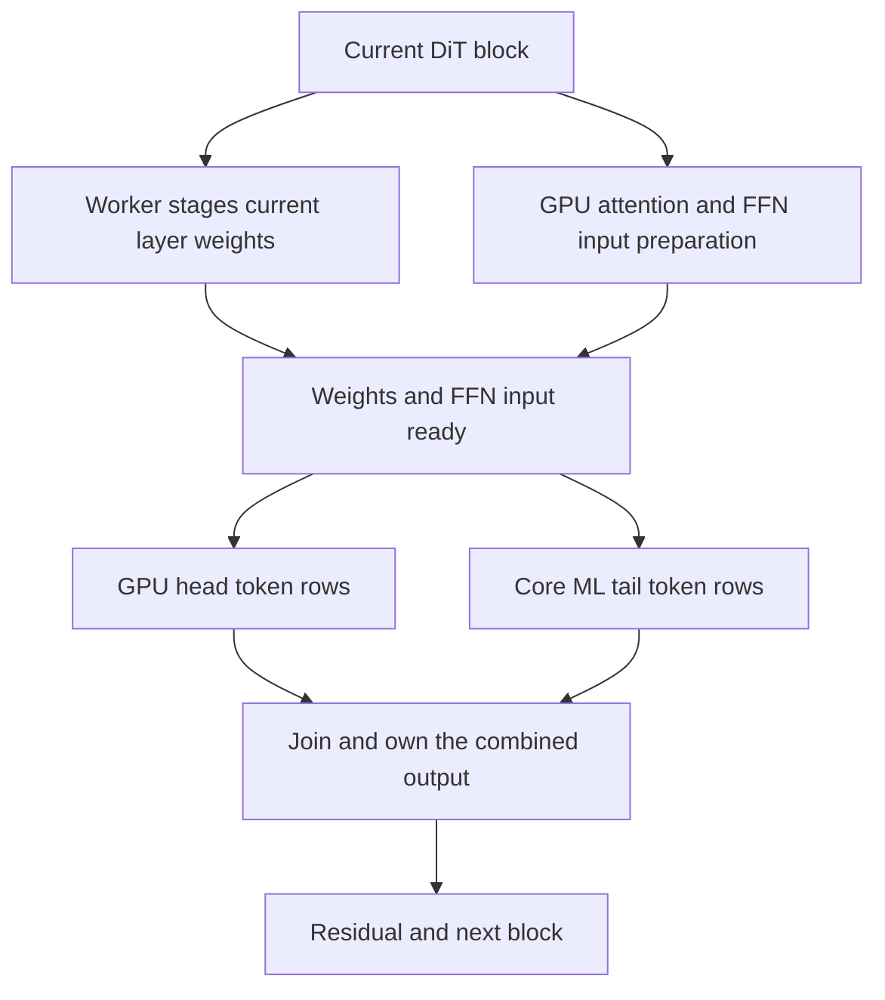

# Laptop Runtime ANE decision — 2026-10-01

This report answers the runtime design questions using the current code and the
M4 Pro / 48 GiB evidence. It closes this bounded laptop acceptance milestone;
experimental W8A8 and encoder ANE routes have not qualified for production.
The `0f8dfa7` App remains the delivered package; the additional checks here do
not change its numerical kernels or enable another default route.

## Runtime weights and disk

Runtime means checkpoint weights are dynamic inputs to a reusable graph. It
**does not mean a disk-free Core ML implementation**. The native loader accepts
an existing compiled graph/manifest, verifies it, and loads a private verified
snapshot. `RuntimeGraph::Impl` drains its worker and releases Core ML objects
before its `ArtifactLease` removes that snapshot. FFN and QKV terminal failures
retire the graph before GPU fallback, so unusable graph resources need not stay
alive until the whole model session ends.

The graph source, user-supplied compiled artifact, and Core ML/OS caches have
separate lifetimes. Private leases use ownership markers and kernel locks;
startup recovery avoids deleting another process's live graph. Interrupted
unmarked directories may be deliberately retained rather than guessed to be
owned by TurboCider. Therefore normal private-snapshot cleanup can be verified,
but **zero disk I/O or zero possible crash/system-cache residue is not promised**.
The checks never delete the user's source graph or checkpoint.

## What overlaps today

Qwen creates the optional DiT runtime after conditioning and before denoising,
subject to memory admission. The graph is independent of checkpoint layer
weights and may be reused across layers/compatible resident requests. Each
block stages that layer's weights before its GPU attention work. When FFN input
is ready, an independent worker runs the ANE tail while MLX runs the GPU head;
the result is joined and owns its storage before reusable buffers are overwritten.
Stable untimed blocks use asynchronous GPU head submission. Timed route-selection
blocks keep explicit fences so the scheduler compares complete block cost.

`stage_wait`, GPU/ANE join windows and pre-FFN time overlap other work and must
not be added as if they were disjoint hardware execution times. The relevant
speed metric is complete request/block wall time with matching work, including
staging, conversion, LoRA correction, copying, synchronization and fallback.
A `cpuAndNeuralEngine` policy or compute-plan preference is not hardware proof.

The existing single-slot design is intentional. Preparing the generic graph
before a requested session can hide load time, but preparing per-layer rotated
weights early needs bounded storage and clear cancellation ownership. Adding a
second weight slot would consume hundreds of MiB at Qwen FFN geometry, and is
not justified by the current laptop data. No additional eager preload or buffer
was added merely to move the cost outside the measured request.

## Token rows versus intermediate channels

| Partition | Current use | Reason and cost |
|---|---|---|
| Token/sequence rows | Runtime-weight FFN; explicit QKV research route | Each FFN row is independent, so complete projections can run on both devices and outputs concatenate. Full layer weights still need staging; short sequences can leave too little work to pay for conversion/join. |
| Intermediate FFN channels | Existing frozen FFN partitions | Devices compute channel slices and combine down-projection contributions. This changes weight shapes/residency and requires the matching frozen artifacts. It is not the same as splitting independent token rows. |

No partition is universally faster. Existing whole-block sampling keeps a GPU
route when mixed execution is slower. Historical M4 Max results demonstrate
that long base-model requests and short Turbo LoRA requests have different
tradeoffs, but they do not establish a speedup on this M4 Pro. The current
laptop has no new matched whole-model Runtime ANE/GPU comparison in this report.

## W8A8, Hadamard and the encoder boundary

The existing runtime slots are FP16. Loading Q4/Q8 checkpoint weights into those
slots is source compression followed by conversion, not proof of W8A8 arithmetic.
Apple documents that activation-plus-weight INT8 can improve ANE latency on
M4-class hardware, while its weight-only compression preserves floating-point
compute. Neither guarantees a speedup for changing runtime weight inputs.
[Activation quantization](https://apple.github.io/coremltools/docs-guides/source/opt-quantization-overview.html),
[weight-only API](https://apple.github.io/coremltools/source/coremltools.optimize.coreml.quantization.html).

The isolated dynamic projection applies the same block Hadamard rotation to
inputs and weights, normalizes them, applies fixed-scale INT8 Q/DQ, and restores
row scales. Its exact-math identity is valid; quantization/FP16 errors and rotation
cost remain. Local tests established its numerical behavior and graph interface,
not hardware INT8 execution. Both small and medium MatMul plans preferred CPU,
and the measured total costs did not establish useful acceleration. Full results
are in [the updated candidate report](runtime-ane-w8a8-feasibility-2026-10-01.md).

A production mixed W8A8 path still requires a complete SwiGLU implementation,
correct LoRA placement around SiLU, an actual GPU A8W8 implementation, and matched
end-to-end comparison including both devices' preparation costs. The current
single-projection candidate does not satisfy those requirements and is kept
outside App/runtime admission. Its negative small-graph result also does not
prove every larger geometry impossible.

Current DiT FFN runtime support and explicit QKV research code already exist.
Qwen's text and vision encoders still run on GPU; `qwen21_module.cpp` rejects
`encoder_ane_manifest`. They run once per request and use different geometry,
DeepStack/vision interfaces and memory lifetimes, so reusing a DiT manifest is
incorrect. Encoder ANE speed/quality and a production dynamic W8A8 path remain
unverified work. The observed reference-encoding improvement is a separate
pure-GPU approximation, not evidence for moving the encoder onto ANE.

## Additional identity-template check

The real `PlaygroundState` importer/template/request exporter produced one
person-only identity request. The delivered `0f8dfa7` CLI executed it with the
existing Qwen/Viggle r128 weights, standard 1024 reference encoding, 512×512
output and six steps. It completed in 38.23 s, reporting 4,096 reference tokens
and 227 LoRA-applied projections. The source was the locally generated adult
portrait from the prior acceptance, not a downloaded/private person's photo.

The output follows the requested green park background and keeps the broad
frontal pose, short dark hair and white collared shirt. Skin/face shading, shirt
folds and contrast change; this verifies template execution and broad visual
reference guidance, not exact face preservation or broad quality qualification.
It was a CLI execution of the actual exported template, not another App click.
Request/receipt/image/visual notes are in
`outputs/goal-closeout-20261001/identity-report.json`.

## Final acceptance and delivery

| Scope | Established result | Practical limit |
|---|---|---|
| Reference and output sizing | Swift importer/canvas tests passed; live reference resize and original restore checked; explicit 512 encoder setting persists through draft/history/API. | File resize and encoder resolution are different controls. Output aspect ratios were covered by state tests, not a new GPU size sweep. |
| Multiple inputs and Playground | Actual NSItemProvider ordering/cancellation tests passed; a public three-reference edit succeeded; actual App outfit and exported identity-template requests completed. | Native mouse multi-file drag was not replayed. Face, fabric and background details can change. |
| App interaction | Settings collapse/reopen, busy-state recovery, output/history display, independent drafts and explicit invalid-setting recovery checked. | This is targeted acceptance, not a claim that every UI path is bug-free. |
| AI interfaces | API client/RPC/installations checks passed (11 + 2 + 8); final packaged RPC checks passed (3). Model discovery and request schemas expose the reference option. | No additional live Qwen service multi-job/cancel campaign was run. |
| Runtime resource lifecycle | FFN and final QKV synthetic Core ML/Metal checks passed; terminal failure releases the private graph before GPU fallback, healthy cancellation permits reuse. | No RSS-level decrease or physical ANE execution claim. |
| Performance choices | Optional 512 reference preview has a measured cold-pair 1.48× ratio. Runtime INT8 is kept experimental because useful acceleration was not established. | Strict preview MAE failed; 1024 remains the default. No new whole-model ANE speedup is claimed. |

The final QKV binary ran for 2.40 s; compile/export/test together took 4.61 s.
Its fixture directory was removed and no private lease remained. The test uses
synthetic weights, not the Qwen checkpoint. Details and reproducible command:
[failure retirement](runtime-ane-failure-retirement-2026-10-01.md).

Delivered archive: `dist/TurboCider-macOS-arm64-0f8dfa7.zip` (63,358,317 bytes).
SHA-256: `b766a56ba5453718395b5d8d1d2f6bd2a4a424fe9f7481848e3c9e0ea5d37b17`.
The local ad-hoc signature, 426 native source identities, 17 executable sections
across seven binaries and 23 archive files were checked at packaging. This final
milestone changes only regression sources and documentation, so it retains that
already verified package. `dist/TurboCider-0f8dfa7-delivery.json` records its build
identity and validation scope. No additional model or dependency was downloaded.
