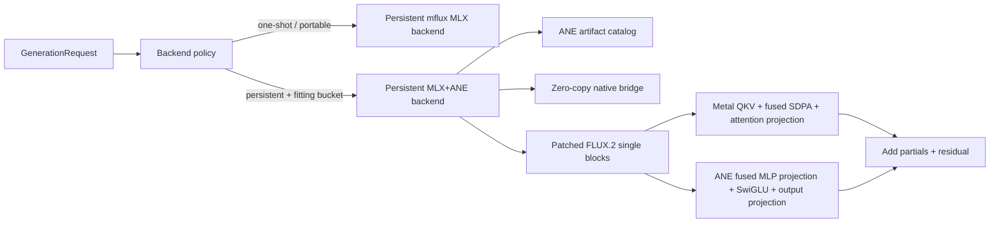

# Architecture

## Design goals

1. Keep a small public API independent of mflux private module paths.
2. Keep models resident and amortize compilation, prompt caching, Core ML load,
   binding construction, and buffer allocation.
3. Make every approximation explicit through a profile or backend mode.
4. Fail closed for experimental attention placement and explicit ANE mode.
5. Let auto mode fall back to MLX for missing buckets or portable one-shot use.

## Module boundaries

| Module | Responsibility |
|---|---|
| `config.py` | Stable enums, engine configuration, requests and profiles |
| `engine.py` | Backend lifecycle, routing and auto fallback |
| `artifacts.py` | Manifest validation and smallest-fitting bucket selection |
| `backends/mlx.py` | Persistent pure-MLX model backend |
| `backends/hybrid.py` | Core ML session cache, bridge lifecycle and metrics |
| `backends/hybrid_ops.py` | Dense/q4 GPU slices and GPU-attention/ANE-MLP overlap |
| `native/flux2_ane_bridge.mm` | MLX buffer protocol to caller-backed `MLMultiArray` |
| `attention/planner.py` | Attention placement traffic model and acceptance state |

The mflux dependency is deliberately behind `mflux_runtime.py`. A future
native model implementation can replace it without changing `Flux2Engine`,
`GenerationRequest`, the artifact catalog, or callers.

## Runtime lifecycle

The expensive objects belong to the backend, not a generation request:

- FLUX.2 weights and tokenizers;
- a Core ML model per enabled block and bucket;
- quantized GPU attention compile functions where profitable;
- one caller-owned `M x 3072` FP16 output per ANE block;
- cached Core ML input/output wrappers and prediction options.

Hybrid requests are serialized per engine because the output buffers are
intentionally reused. Multiple independent engine processes can provide
parallelism when memory permits.

## Compatibility boundary

The current adapter targets mflux FLUX.2 Klein 4B and checks the artifact
manifest at runtime. It uses a process-wide attention dispatcher that delegates
unchanged for ordinary mflux models and only activates on engine-bound blocks.
This is less invasive than maintaining a fork but still depends on selected
mflux internal names; integration tests must be run when upgrading mflux.

