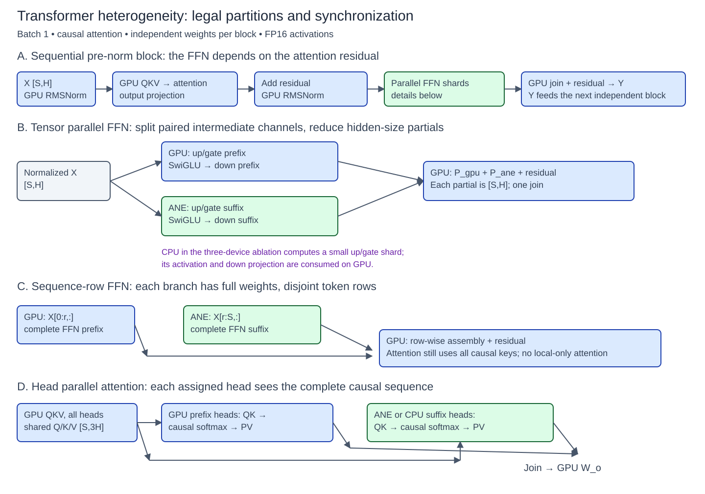
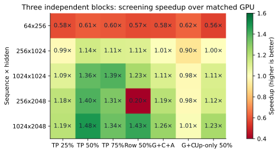
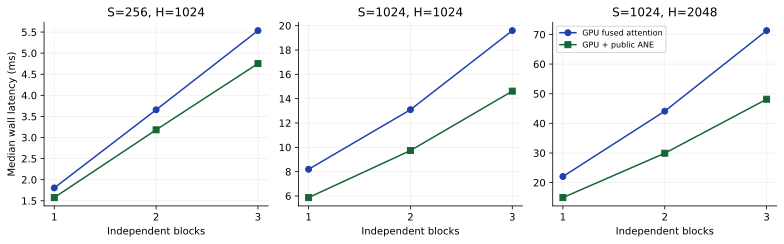
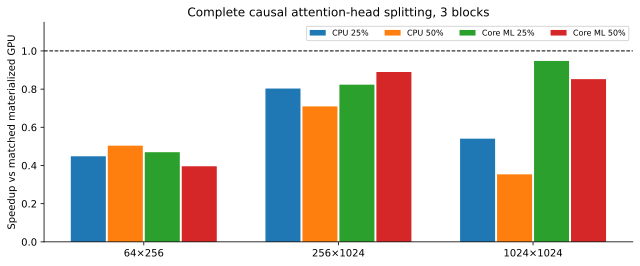
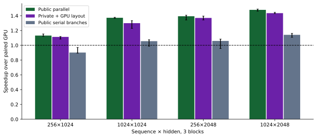
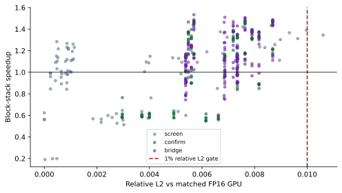

# Apple M4 Pro 上 Transformer 的 CPU/GPU/ANE 异构并行：切分、同步与编译边界

**TurboCider experimental/transformer · 技术研究报告 · 2026-09-10**

## 摘要

本文在 Apple M4 Pro（14 核 CPU、20 核 GPU、48 GB 统一内存）上，实现并测量 1–3 个独立 causal Transformer block，比较 FFN tensor parallel、FFN sequence-row parallel、完整 attention-head parallel，以及 CPU/GPU/ANE 三设备投影切分。所有方案保持同一完整 FP16 权重；计时包含层间依赖、设备同步、布局转换与输出合并，并以独立 FP32 算法校验输出。通过形状筛选、三轮 fresh-process 确认、编译计划检查和串行分支消融，本实验发现：**较大矩阵的 FFN 成对中间通道切分最有效，稳定收益约 1.47×；确认矩阵的最高组中位数约 1.50×。** 小尺寸通常亏损，完整 head 分片未获胜，三设备并不自动优于两设备。public Core ML 的 caller-owned output backing 已有较强表现；private API 的低层调用优势会被布局转换抵消。所有数字均是本机 synthetic block-stack 的热运行结果，不能解释为预训练模型或完整生成流程的加速承诺。

**关键词：** Apple Silicon；Transformer；异构推理；张量并行；Core ML；ANE；统一内存。

## 1. 研究问题与相关工作

本研究回答四个问题：哪些并行轴在代数上成立；在多大的形状上能偿还同步成本；层数从 1 增至 3 后收益是否保留；public/private API 的差距来自计算、编译还是数据边界。

Megatron-LM 提供了按 attention head、MLP 中间通道拆分并归约的基本思路；其集群训练收益不能直接移植为单机异构推理收益。[Megatron-LM](https://arxiv.org/abs/1909.08053)。论文中的 sequence parallel 还包含训练激活管理；本文明确把无跨 token 依赖的 FFN 行切分与完整 context parallel 区分。[Sequence parallelism](https://arxiv.org/abs/2205.05198)、[Context parallel documentation](https://github.com/NVIDIA/Megatron-LM/blob/main/docs/user-guide/features/context_parallel.md)。

Apple 对 ANE 的建议强调 channels-first 四维布局、1×1 convolution 与减少复制；因此本文既测试 public 的二维输入/输出 ABI，也在 private 路径上显式测量四维 channel-first 变换成本。[Apple ANE Transformer guidance](https://machinelearning.apple.com/research/neural-engine-transformers)。完整调研与来源对照见 [RELATED_WORK.md](RELATED_WORK.md)。

本实验继承 mac_local_ai 的 MPS、BNNS、Core ML 和 fused attention 基础设施，在 TurboCider 的独立 experimental 目录扩展。此前 M4 Max 的真实模型数字未混入本次统计。

## 2. 模型、数学拆分与依赖

### 2.1 完整 block

输入 X 为 [S,H]，FFN 中间维 F=4H，默认 head dimension d=64。模型为 batch=1、causal multi-head attention，无 GQA、RoPE、dropout、embedding 或 LM head：

```text
N1 = RMSNorm(X)
Q,K,V = N1 Wqkv
A = concat_h(softmax(Qh Kh^T / sqrt(d) + causal_mask) Vh)
R = X + A Wo
N2 = RMSNorm(R)
Y = R + ((N2 Wu) * SiLU(N2 Wg)) Wd
```

使用 FP16 权重/激活。每层权重来自固定种子 1000+layer，经方差缩放后转 FP16；norm 权重为 1，QKV bias 为 0。各层权重和缓冲独立，前层输出实际成为后层输入。输入为固定 LCG 生成的 FP16 张量，因而同 shape 的所有计划可严格重建同一问题。

attention residual 产生前，本层 FFN 不能开始；不同层也不能凭空并行。本文不把串行 pre-norm block 画成 attention/FFN 两条独立分支。



*图 1：蓝色为 GPU，绿色为 ANE 候选分支；CPU 除调度外，在指定消融中计算小投影 shard 或完整 attention head。所有连接表示实际依赖。*

### 2.2 FFN tensor parallel

将 F 分成不相交集合 I_gpu、I_ane（可选 I_cpu），每个分片包含相对应的 up/gate 通道：

```text
P_d = ((N2 Wu[:,I_d]) * SiLU(N2 Wg[:,I_d])) Wd[I_d,:]
Y = R + sum_d(P_d)
```

通道内激活是局部的，down projection 对中间维线性，故这个分解在实数代数下成立；不同设备的 FP16 累加和激活实现会产生近似误差。最佳 public 计划使 GPU 和 ANE 各完成其完整 FFN shard，只返回 [S,H] partial。50% 分片且 F=4H 时，完整 shard 的返回张量比仅返回 up/gate 激活小 4 倍。

对照 `projection50` 只在 ANE 做 up/gate，后续激活/down 在 GPU 消费。三设备方案也属于投影切分：CPU BNNS 计算小 up/gate shard，激活与 down 仍在 GPU。不能把该三设备实现描述成三个完整 FFN 分支。

### 2.3 FFN sequence-row parallel

对行集合 T_gpu 与 T_ane，计算 FFN(N2[T_d,:])，按行合并。由于 FFN 不混合 token，代数上不需要跨设备归约；代价是每支持有完整 FFN 权重和形状相关的编译计划。attention 保留完整 causal context。本实验没有把各行分片内的局部 attention 误当成完整模型。

### 2.4 Attention-head parallel

QKV 投影在 GPU 完成；各分支接收完整序列，按完整 head 计算 QK、causal softmax、PV，最后回到 GPU 做 output projection。CPU 使用 FP32 BLAS 与稳定 softmax，输出转 FP16；ANE 候选使用 Core ML 固定形状图。测试 25%/50% head 后缀，而不是仅拆 QKV 矩阵乘。

该版本使用 materialized attention GPU 对照，以隔离 head 切分影响；它已经不能获胜，因此不能据此声称能超过更强的 fused GPU attention。

## 3. 实现与公平性控制

GPU 基线采用 MPS GEMM，分别验证 MPSGraph SDPA 和 mac_local_ai 的 Steel fused attention。默认 d=64 的确认使用 fused attention；d=32/128 使用 SDPA。每个 GPU block 以一个 command buffer 为主要边界；跨层是实测顺序执行，而非把单层时间乘 L。

异构分支使用常驻 worker、常驻权重和预分配输出。public 配置限制为 CPU_AND_NE，防止 Core ML 使用 GPU 与显式 Metal 分支竞争；逐次检查 output backing 对象和指针。该配置本身不证明 ANE 执行，所以另存 MLComputePlan 首选设备。compute plan 属于编译计划证据，仍不是 Instruments 硬件时间线。[Output backing API](https://developer.apple.com/documentation/coreml/mlpredictionoptions/outputbackings?language=objc)、[MLComputePlan guidance](https://developer-mdn.apple.com/videos/play/wwdc2024/10161/)。

private 版本使用独立实验二进制，经 in-memory MIL、动态权重 blob 与 IOSurface 调用 ANE。完整 shard 的数学和 FP16 权重与 public 相同；private 用 1×1 conv 表达，public 用 matmul 图表达，因此这里比较的是两种可运行端到端实现，**不是只改变函数名的纯 wrapper 微基准**。分别实现 CPU 转置和 16×16 tiled GPU 转置，均计入 branch wall time。private ABI 来源及 MIT 声明见 [THIRD_PARTY.md](THIRD_PARTY.md)。

原始 runner 的 ANE=0 concat 解引用、CPU shard 内生权重与 synthetic 层共享问题均在实验 adapter 中处理。保留原文件和生成脚本，未更改生产 TurboCider 路由。所有环境路径、命令和 stderr 随原始结果保存。

## 4. 实验方法

@@METHOD_TABLE@@

预筛选覆盖 (S,H)=(64,256)、(256,1024)、(1024,1024)、(256,2048)、(1024,2048)，F=4H，L=1/2/3；七种计划共 105 组。完整 head 实验另有 36 组。之后对 50% 完整 FFN shard 做三轮独立进程确认，再加入 GPU bridge、串行消融、head dimension 变化、SP 异常与 CPU 尾部复测。不是穷举所有可能尺寸和调度器。

筛选每组 8 次 warmup、30 对测量；主要确认 10 次 warmup、40 对，每次交替 GPU-first / heterogeneous-first。public/private 的进程顺序在轮次间反转。原始 p50/p95 与逐次 wall samples 均保留。表中的速度比是各轮 p50 速度比的中位数；95% 区间通过先重采样轮次、再以连续 4 对为块重采样得到（1,500 次，固定 seed）。只有三轮，区间不能覆盖跨机器、温度状态、系统更新或长期尾延迟。

质量门槛为相对 FP16 GPU 的 relative L2 ≤ 0.01、cosine ≥ 0.999，并报告独立 FP32 参考误差；该门槛是数值接受条件，不是语言或视觉任务质量证明。独立参考另用小尺寸 FP64 direct einsum 检验，避免只比较两条共享 GPU 算法的路径。部分 NumPy/Accelerate 调用打印浮点状态 warning；最终数组和指标的 finite 校验及独立 FP64 差分单独保存，未将 warning 当作成功证明。

“有效进程测量”表示运行完成、计时可解析，不表示每个候选均通过数值门槛。

计时是本次完整 block-stack 的 host wall latency，包含 worker、转换、等待、join、norm、attention 和 residual。模型生成、编译、加载不包含在热循环内，单独记录。未实测功耗和能源，因此全文“高效”仅指给定数值误差约束下的延迟。

## 5. 性能结果

### 5.1 形状与切分比例



*图 2：相对同权重 GPU 的三层筛选速度比。TP 百分比表示 ANE 获得的 FFN 中间通道比例。G+C+A 使用 50% ANE、6.25% CPU；G+C 为 6.25% CPU。小于色标下限的负结果仍保留准确数值。此图为筛选，不是三轮确认。*

小尺寸中，固定调度成本大于被转移的计算；64×256 的所有异构计划均较慢。H、S 增大后，完整 FFN shard 明显优于只拆 up/gate。把更多通道给 ANE 不必然更快：50% 在大形状上优于 75%，后者还有更高的误差。

### 5.2 独立 1–3 层确认

@@MAIN_TABLE@@



*图 3：fused attention 对照下的独立层数扩展，时间来自三次独立进程的中位数。两个 backend 在每次进程内交替测试。*

不同 suite 的绝对 GPU 延迟存在明显漂移：例如同一 1024×2048 两层，在 confirm 和 bridge 的组中位数分别约 44.1 和 55.2 ms。因此优先解释进程内配对速度比，不把跨 suite 的绝对时间差当作算法收益；图 3 的斜率也不是固定的每层开销测量。

主要结果是 S=1024、H=2048、F=8192 的 1/2/3 层均保持约 1.47×，即约 32% 延迟降低。另一轮 bridge 确认的最高组中位数约为 1.50×。这支持“完整 FFN shard 能在较大形状下获益”，不支持“所有 Transformer 都能 1.5×”或“已经达到硬件上限”。小尺寸确认仍为负收益，避免只展示成功形状。

### 5.3 三设备 CPU 尾部

@@TRIPLE_TABLE@@

该消融保持 materialized FFN 调度、ANE 50% 不变，仅改变 CPU 的成对中间通道数；它比把三设备结果与不同图结构的两设备结果直接比较更公平。CPU 参与要同时抵消额外 worker、投影输出合并和 GPU 后续消费成本。即使某个小尾部有局部改善，最终仍应与完整 ANE FFN shard 的全局最佳计划竞争；本实验不要求三台设备必须同时计算。

### 5.4 完整 attention-head 并行



*图 4：三层完整 attention head 分片，相对 materialized GPU 对照。CPU 和 ANE 均计算完整 causal head。*

所有这些三层点均小于 1×。另有一个单层小尺寸点（64×256、CPU 承担 2/4 heads）首次运行 relative L2=0.065147，未通过门槛；三次独立诊断复测均为 0.000881，但原始异常原因尚未定位。失败数据保留，不能因复测通过而删除；该路线仍不建议采用。CPU 后缀随序列增长成为明显慢分支；ANE 候选也增加 prediction、head layout 和同步边界。head 的数学独立性只能保证正确拆分，不能保证异构速度。没有以降低 causal context 或只做局部 attention 来制造收益。

@@HEAD_PLAN@@

### 5.5 Sequence-row 的失败与编译分配

@@SP_TABLE@@

S=256、H=2048 的半行 FFN（ANE 候选实际输入 128 行）在编译计划中全部主要算子首选 CPU，复测约 0.19×；因此其 `up_ane_p50_ms` 字段实际上是 Core ML worker wall time，不能称作 ANE 硬件时间。S=1024 的行切分是否有效，必须按其独立计划和数据判断。这个反例说明，shape-dependent compiler placement 可以比最后一次 concat 更重要。

## 6. Public / private API 与重叠消融

@@API_TABLE@@



*图 5：相同 50% FFN 切分的 public 并行、private GPU 转置和 public 串行分支。误差条是本次分层 bootstrap 95% 区间；每组均使用进程内 GPU 对照。*

private CPU 转置在长矩阵上开销明显。换成 GPU tiled transpose 后，布局桥接得到改善，但 private 仍未形成稳定超越 public 的证据。public 已避免默认输出分配/复制，private 额外 layout kernel 和屏障仍需付费；统一内存只减少地址空间之间的显式复制，并不消除布局变换、资源生命周期或同步。

将同一 public 分支改为串行后，收益下降。这个消融保持数学、权重、返回形状不变，支持“设备计算重叠贡献了实测收益”的解释。它不是硬件 trace，也不能精确分离所有共享带宽竞争。

@@OVERLAP_TABLE@@

## 7. 编译、加载和首次执行

@@STARTUP_TABLE@@

public 的 `.mlpackage → .mlmodelc` 编译调用与 private `compileWithQoS` 不是同一个工作边界：public 仍可能在 MLModel 加载/首次运行发生硬件 specialization；private 已直接调用 ANE 编译。因此不能把两个 compile 数字相除当作“编译快多少倍”。表中明确分开 public export/compile、model load、first prediction，以及 private compile/load/first prediction。private 首次 prediction 包含 GPU 布局桥接。

全部是本次已有系统缓存状态下的调用时长，没有清空系统全局缓存来宣称纯 cold compile。fresh process 总时间也包含 Metal kernel/pipeline、权重文件 I/O、内存分配、warmup 和所有测量迭代，不能直接减去一次 hot latency 得到 load time。

## 8. 数值可靠性与维度敏感性



*图 6：FFN 的 screen/confirm/bridge 三阶段进程的速度与 relative L2；红虚线为预设 1% 门槛。颜色只表示实验阶段。*

@@QUALITY_TABLE@@

完整 ANE FFN 的误差高于只把 up/gate 放在 ANE 的路径，且随层数和 ANE 份额上升。该现象提示激活/down 的设备实现和累加位置需要关注，但目前没有单独逐算子误差分解，不能把全部差异归因于某一种激活近似。75% ANE 的 1024×2048 三层筛选超过 1% relative L2 门槛，不能作为合格最佳点。

@@HEAD_DIM_TABLE@@

head dimension 32/64/128 还改变 GPU attention 实现选择，因此其速度变化不能全部归因于 head 数量。这里采用固定完整权重、按各 head 配置重建参考。多 seed、训练权重、量化和不同系统版本仍需新的校准。

## 9. 成本模型与更高效的执行建议

单个顺序 block 的可操作成本模型为：

```text
T_hybrid = T_attention_and_norm
         + max(T_gpu_shard, T_ane_shard, T_cpu_shard)
         + T_dispatch_and_join
```

这是解释模型，不是把独立 microbenchmark 的 max 当成实测 block 时间。若有效吞吐为 r_gpu、r_ane，忽略固定成本时，ANE 通道比例的初始估计为 r_ane/(r_gpu+r_ane)；真实最优必须再按 shape、编译分配、转换和 UMA 争用校正。

对于 F=4H，线性层 FLOP 约为 32SH²，显式 dense attention 约为 4S²H（未扣 causal 跳过）。这说明较大 H 给 FFN 更多并行机会，但 FLOP 比例不是延迟比例，不能由此直接推导硬件上限。随着 S 增长，attention 占比和内存行为还会改变。

本次证据支持以下执行顺序：

1. 先选择快的完整 GPU attention 基线，再评估 FFN 分片；不要利用慢基线制造加速。
2. 对较大 shape 从 50% 完整 FFN shard 起搜；GPU/ANE 两支完成 up、gate、activation、down，只合并 hidden-size partial。
3. CPU 默认承担调度，小计算尾部只作为可选计划；用同一图结构消融决定是否启用。
4. 为每个 shape 检查 compute plan；把 CPU fallback 与 ANE 运行分开。行切分会改变每支 shape，不能继承未切分模型的设备归属。
5. 公共接口优先使用常驻 MLModel 和验证过的 output backing；private 只有在布局桥接后仍有端到端收益时才有实验价值。
6. 保留 GPU fallback 与数值门槛；保存设备、OS、shape、权重和分片配置，而非采用跨设备统一比例。

## 10. 局限与可复现性

本报告仅对这一台 M4 Pro 和 synthetic FP16 block-stack 有证据。未测完整语言/图像生成、decode KV cache、跨请求吞吐、batch>1、长于 1024 的上下文、量化、多种权重种子、功耗或峰值内存。当前常驻实现复制了一些基线/分片权重用于公平对照，不是最低内存实现。

head split 为显式 materialized 图，未穷举 ANE-specific attention lowering；其负结果约束的是本实现，不是证明所有 head 并行都不可能。SP 只覆盖 FFN 行。private GPU 转置使用单独 Metal 资源 identity，已做等待后交接；不主张它具有跨 Core ML 的自动 hazard tracking。三轮置信区间是描述性证据，而非跨环境保证。

@@COUNT_TEXT@@

完整数据在 [measurements.csv](measurements.csv)、[measurements.json](measurements.json)、[summary.json](summary.json)；每个原始 JSON 保存命令、返回码、stdout/stderr 和进程总时长。复现入口见 [实验 README](../README.md)，预先协议及实现修正见 [PROTOCOL.md](PROTOCOL.md)。所有图可从原始结果重建，SVG 可直接用于后续论文或技术文档。

## 11. 缓存清理

@@CLEANUP_TEXT@@

## 12. 结论

在本次完整独立 block-stack 上，**GPU attention + GPU/ANE 完整 FFN 通道分片**是最有证据的方案。较大尺寸约 1.47× 的收益在 1–3 层保持，确认矩阵的最佳组中位数约 1.50×；小尺寸、CPU 尾部、head 分片和 shape-dependent CPU fallback 则说明异构并行必须按形状选择。public Core ML 已足以实现主要收益，private 调用层更直接也不能免除数据边界成本。
